2022년 말에 공개된 ChatGPT는 출시 단 5일만에 100만 명의 이용자 수를 달성하면서 엄청난 AI 열풍이 일으켰다. 이후 현재까지 꾸준히 버전을 높여 GPT-5 모델을 공개했으며, Claude, Gemini, DeepSeek 등 다양한 LLM(Large Language Model)이 나왔고, 일상생활 곳곳에 깊이 자리를 잡고 있다.

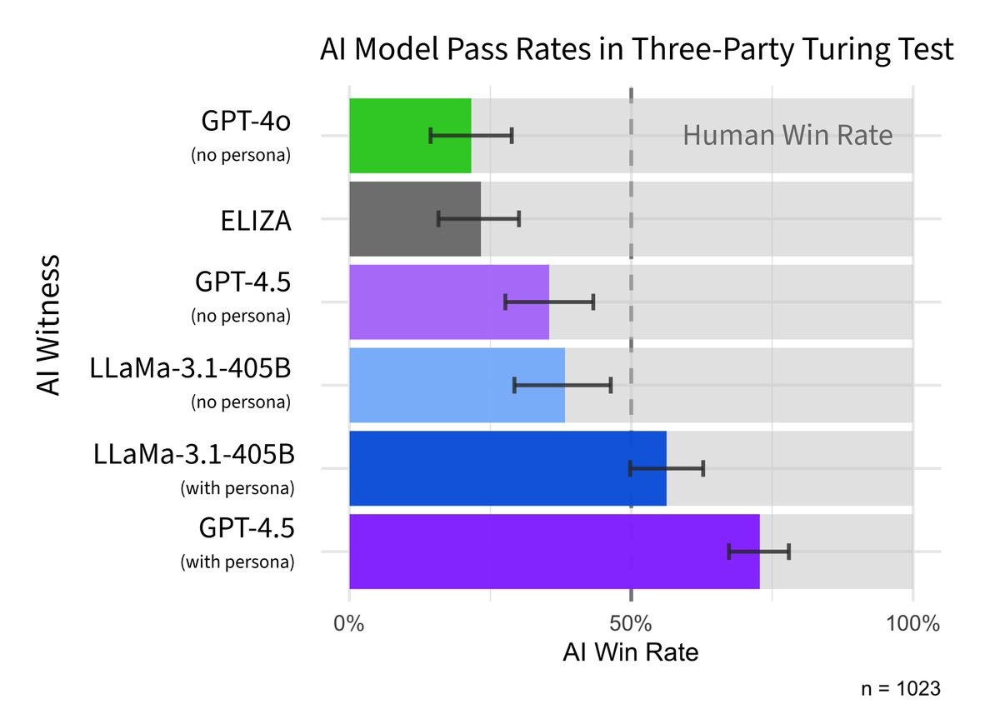

[https://arxiv.org/abs/2503.23674](https://arxiv.org/abs/2503.23674)

최근 \*튜링 테스트 재현 연구에 따르면, 5분 간의 채팅에서 73%의 경우 GPT-4.5를 인간으로 생각했다. 이처럼 정말 사람과 대화하는 듯한 LLM은 마법처럼 문장을 만드는 것일까? LLM이 자의식을 가지고 생각한다고 느끼기 쉽지만, 그 근본 원리는 단순하다. 바로 **이전 단어들을 보고 다음에 올 단어(정확히 말하자면 ‘토큰’)를 하나씩 예측하여 이어 붙이는 것**이다.

---

\*튜링 테스트(Turing Test): 옆 방에 있는 대상 (혹은 기계)와 대화하는데 사람인지 기계인지 구분하기 힘들면 지능을 갖췄다고 판단하는 시험

# 1/ LLM 연대기 (2017-2025)

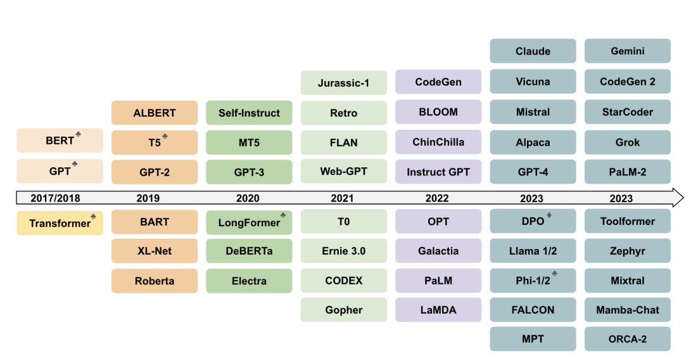

[https://arxiv.org/pdf/2402.06196](https://arxiv.org/pdf/2402.06196)

`2017` Attention is All You Need 논문이 공개되면서 현재 LLM의 기반이 되는 Transformer 모델 등장

`2018-2020` BERT, GPT-1/2/3

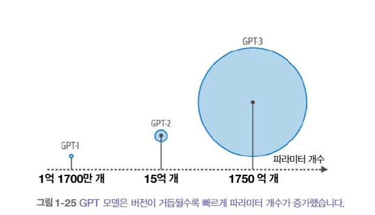

**Hands-On Large Language Models (2024)**

- GPT-1 : 1억 1700만 개의 \*파라미터
- GPT-2: 15억 개의 파라미터
- GPT-3: 1750억 개의 파라미터

---

\*파라미터(parameter): 여기서의 파라미터는 신경망 모델 내 뉴런의 출력과 인접 뉴런 간 연결에서 상대적 가중치를 제어하는 수치.

### Scaling Law

[https://arxiv.org/pdf/2501.04040](https://arxiv.org/pdf/2501.04040)

`2020` [Scaling Law](https://arxiv.org/abs/2001.08361?utm_source=chatgpt.com) - 모델의 크기가 커지면 커질수록 성능이 좋아진다는 것을 입증했다. 모델이 일정 크기 이상 커지자, 갑자기 복잡한 문제를 잘 해결하기 시작한 것이다. 이를 Emergent Ability(창발적 능력)이라고 부른다.

이때, GPT 기반 생성형 모델이 주류로 부상했다. GPT-1/2/3 버전이 업그레이드되면서 파라미터 개수도 급증한 것을 확인할 수 있다. Large Language Model의 Large는 훈련 데이터 규모와 파라미터 수가 크다는 의미로 사용된다.

(이러한 거대 언어 모델이 부상하면서 고성능 GPU에 대한 수요도 급증하여 NVIDIA 기업 가치도 수직 상승해했다,,,)

`2022` GPT-3을 기반으로 한 ChatGPT (GPT 3.5) 모델 등장.

`2023-2025` Multimodal, Long Context(장문 입력), Reasoning(추론) 모델 등장.

긴 문맥을 기억하는 Long Context, 시각과 텍스트 모두 처리할 수 있는 Multimodal, 복잡한 문제를 단계별로 쪼개 푸는 Reasoing 모델이 등장하고 있다.

LLM 연대기의 분기점은 Transformer이며, 오늘날의 생성형 LLM은 이를 바탕으로 발전해 왔다.

# 2/ LLM 작동 원리

## 2.1 “한 번에 한 토큰씩 추가하면서 계속 이어쓰기”

ChatGPT를 사용하면서 모델이 한 글자씩 작성되면서 응답한다고 느낄 때가 많지 않나요? 사실, LLM은 문장을 통째로 한 번에 만드는 게 아니라 확률적으로 가장 적절한 다음 토큰을 예측해 매번 하나씩 이어 붙인다.

### Next Token Prediction(다음 토큰 예측)

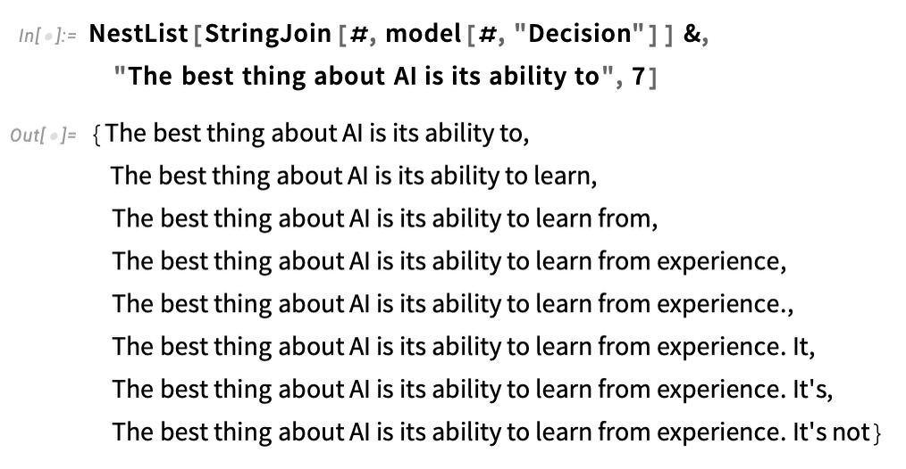

LLM은 입력 (프롬프트)와 지금까지 생성된 토큰을 보고 매번 전체에 대한 확률 분포를 계산하고, 해당 확률 분포에서 다음 토큰의 확률을 계산하고, 그 중 하나의 토큰을 선택해 이어 붙이는 방식으로 문장을 만든다.

즉, 다음에 올 수 있는 단어들의 목록과 확률을 생성하는 것이다.

### Autoregressive(자기회귀)

LLM (더 정확하게 말하자면 Decoder-only LLM)은 정방향 계산을 수행한 후 다음 토큰을 생성하는데, 출력된 토큰을 입력에 추가하여 다시 전달한다. 즉, 이전 시점의 출력을 현재 시점의 입력으로 사용해 다음 출력을 예측하는 것을 의미한다.

## 2.2 확률은 어떻게 만들어지는걸까?

확률 분포로부터 확률이 만들어진다. 그럼 확률 분포는 어떻게 만들어지는걸까? LLM이 학습한 방대한 웹, 책 등의 인간 텍스트 데이터를 통해 만들어진다. 그래서 LLM의 출력이 사람이 작성한 것과 유사한 이유이다. (사람 데이터를 보고 배웠으니 출력도 그러한 것이다.)

해당 데이터들로부터 학습하여 “해당 문맥에서는 어떤 단어가 주로 왔는가”라는 조건부 확률 $p(다음 토큰 | 이전 토큰들)$을 맞히도록 학습한다. 계속 그럴 듯한 문장을 생성하는 게 LLM의 핵심이다. 확률을 통해 “다음에 어떤 토큰들이 올 수 있는가에 대한 가능성”을 보는 것이다.

### Sampling(샘플링)

확률을 기반으로 다음 토큰을 선택한다고 했는데, 그럼 단순히 항상 가장 높은 확률의 토큰을 선택하면 좋을까? 대부분의 경우 해당 방식은 별로 좋지 않다. 오히려 무작위로 비교적 낮은 확률의 단어들을 선택했을 때 더 풍부한 텍스트를 생성할 수 있다. 이처럼 텍스트 생성의 무작위성 또는 창의성을 조절하는 매개변수 temperature(온도)가 있다. 주로 0-2 사이의 값으로 temperature가 0이면 탐욕적으로 항상 확률이 가장 높은 단어가 선택되므로 일관된 응답이 생성된다.

---

\*temperature(온도): 정확히 말하자면 softmax 함수로 모델 출력을 정규화하기 전에 (확률 형태로 만들기 전에) 나누어주는 값으로, 0으로 설정하면 가장 큰 출력 값의 토큰 확률은 1이 되고, 나머지는 모두 0이 된다.

# 3/ LLM 모델

## 3.1 기호주의(Symbolism) vs. 신경주의(**Connectionism)**

기호주의 혹은 계산주의는 인간이 직접 만든 규칙을 바탕으로 논리를 세우고 이를 주입하는 방식이다.

규칙과 논리가 명확하므로 투명성이 보장되는 편이다. 반대로, 신경주의는 일일이 규칙을 만들지 않고, 데이터로부터 스스로 학습하는 관점이다.

현재 AI는 신경주의 관점 위에 서 있다. 하지만 처음부터 그랬던 것은 아니다. 초기 AI의 주류는 기호주의였다.

흔히 AI Winter가 온 이유가 초기 기호주의 AI 때문이다. 신경망 기반 모델이 엄청난 성능을 보이면서 AI Winter를 끝내고 현재까지 이르게 되었다.

한 편으로는 기호주의 + 신경주의 관점, 이른바 뉴로심볼릭(Neuro-Symbolism)도 생겨나고 있다. 신경망 기반 모델에 규칙을 주입하는 것이다. 이 관점이 점점 중요해지고 있는 것 같다.

## 3.2 신경망(Neural Network)

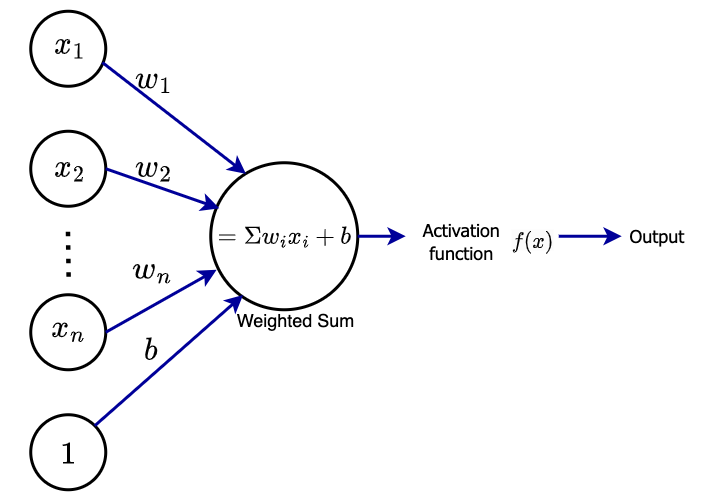

[https://intuitivetutorial.com/2023/07/23/activation-functions-in-deep-learning/](https://intuitivetutorial.com/2023/07/23/activation-functions-in-deep-learning/)

신경망은 인간의 두뇌가 작동하는 방식을 모델한 모델이다. 뉴런(neuron;신경 세포)이 연결되어 있는 것처럼 신경망도 인공 뉴럽의 집합으로 구성되어 있습니다. 연결은 가중치를 의미하고, 활성화 함수(activation function)을 한다.

인간과 유사한 작업을 수행하는 모델은 단순한 수학적 법칙이 아닌, 훈련을 통해 스스로 특징을 발견하는 방식으로 작동한다.

### Universal Approximation Theorem(보편 근사 정리)

Universal Approximation Theorem은 신경망이 왜 중요한지 설명해주는 이론이다.

은닉층(hidden state)가 하나밖에 업는 단순한 모델이라도, 뉴런(neuron) 수가 충분히 많고, 활성화 함수(activation function)이 비선형 함수라면 신경망은 어떠한 연속 함수라도 근접하게 근사할 수 있다는 것이다.

### Blackbox(블랙박스) 모델

수많은 데이터를 바탕으로 고양이 사진을 보고 고양이인지, 강아지인지 분류할 수 있지만, 정확히 어떻게 그렇게 생각하는지는 알 수가 없다.

모델 파라미터는 결국 한정되어있는데 방대한 지식을 주입하다 보니 한 뉴런이 여러 개념을 중첩해 갖고 있다. 즉, 수많은 뉴런과 가중치가 아주 복잡하게 얽혀 있어 해석하기 어려운 상황이다. 특정 입력에 대해 왜 해당 출력이 도출되었는지 설명이 거의 불가능하다.

블랙박스 모델의 내부를 들여다보기가 무척 어렵기에 신뢰성, 안정성을 다룰 때 더 문제가 되고 있다.

## 3.3 Transformer - _Attention Is All You Need_

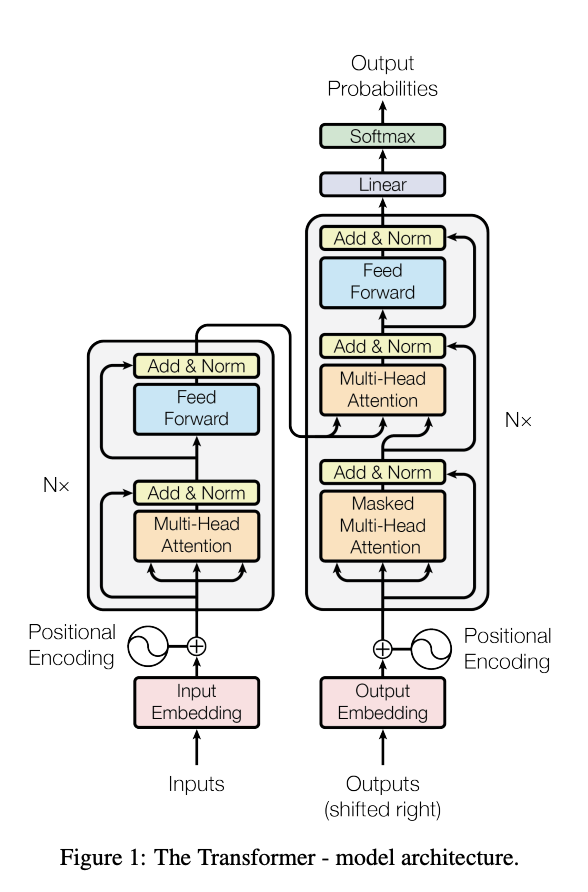

[https://arxiv.org/abs/1706.03762](https://arxiv.org/abs/1706.03762)

대부분의 LLM은 2017년에 공개된 “Attention Is All You Need” 논문에서 소개된 Transformer(트랜스포머) 아키텍처를 사용한다.

### Tokenization(토큰화)

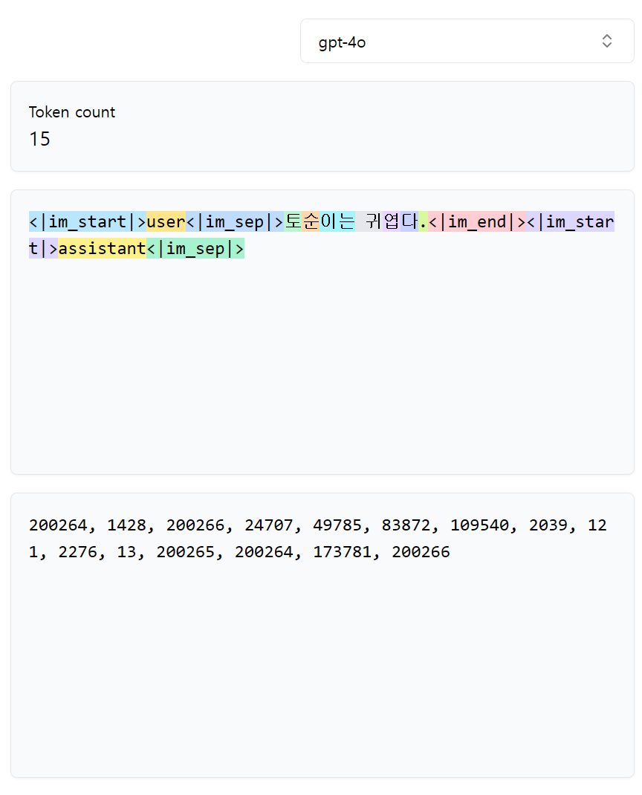

[https://tiktokenizer.vercel.app/](https://tiktokenizer.vercel.app/)

토큰화는 텍스트를 단어, 또는 부분 단어 등과 같은 더 작은 단위로 쪼개는 과정이다. 모델에 따라 토큰나이저(tokenizer)가 다를 수 있다. 코드 생성 모델같은 경우 코드에 특화된 특수 토크나이저가 필요하기도 하다. 토큰나이저의 종류에 따라 토큰을 서로 다르게 처리할 수 있다. (계산 효율성과 모델의 성능에 영향을 미친다.)

### Embedding(임베딩)

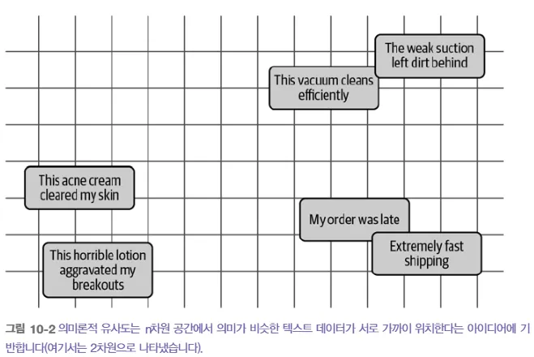

**Hands-On Large Language Models (2024)**

모델이 텍스트를 처리하기 위해서는 텍스트를 숫자로 표현해야 한다. 임베딩은 텍스트, 이미지 등의 “본질” (텍스트라면 의미)을 숫자 배열로 표현하는 것으로, 의미상 가까운 것은 임베딩 공간에서 가까운 숫자로 표현된다.

### Attention(어텐션)

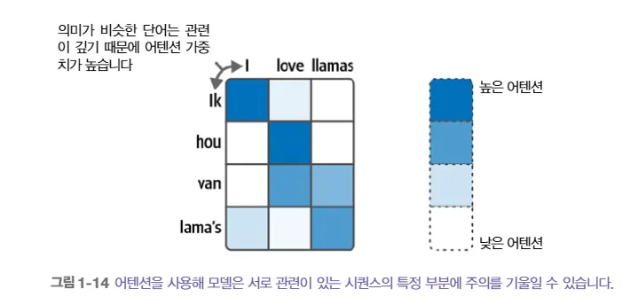

**Hands-On Large Language Models (2024)**

토큰 시퀀스 내의 어떤 토큰에 더 “집중”해야하는지 알려주는 매커니즘이다.

_The cat chased the mouse because it_ 문장에서 _it_ 다음에 올 토큰을 예측하려면 *it*이 무엇을 가리키는지 알아야 한다. _attention_ 매커니즘은 _it_ 토큰 표현에 문맥 정보를 추가하여 무엇에 더 주목해야하는지를 알려준다. *“chased”*는 *“mouse”*에 더 주목해야 한다는 것을 알려줍니다.

이처럼 attention은 문맥을 이해하는데 효과적이다. self-attention은 문장의 각 단어가 다른 모든 단어를 참고하여 전체 문맥을 더 깊이 이해할 수 있도록 도와 텍스트 내 단어들의 위치에 상관없이 서로 멀리 떨어진 단어들까지 연관 지을 수 있도록 만들어 전체 문맥을 더 깊이 이해할 수 있다.

# 4/ BERT vs. GPT

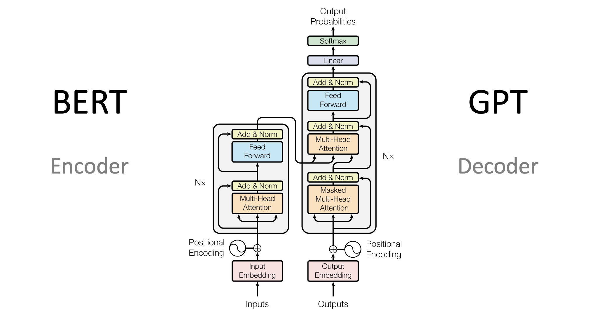

[https://heidloff.net/article/foundation-models-transformers-bert-and-gpt/](https://heidloff.net/article/foundation-models-transformers-bert-and-gpt/)

Transformer는 Encoder-Decoder 모델로, encoder로 입력을 인코딩하고 decoder로 출력을 생성한다.

## 4.1 Encoder-Only

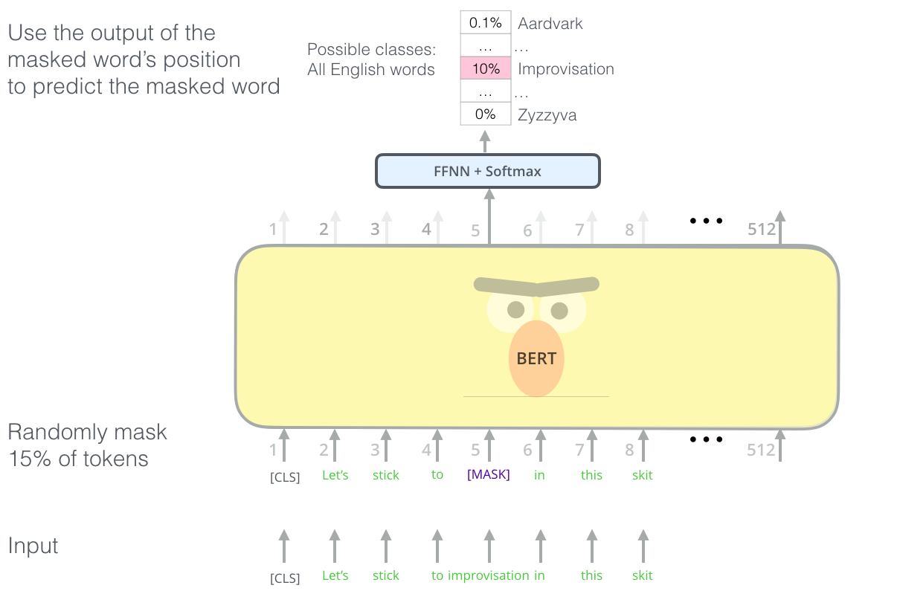

[https://jalammar.github.io/illustrated-bert/](https://jalammar.github.io/illustrated-bert/)

Encoder 기반 모델은 주로 representation model(표현 모델)이라고 일컫는다. 주로 언어를 표현하는 데 중점을 둔다. 대표적인 Encoder 기반 모델인 BERT의 아키텍처를 살펴보면, 입력에는 [CLS] 토큰 혹은 분류 토큰이 포함되어 있으며, Masked Language Modeling 기법을 사용해 단어를 무작위로 마스킹한 후, 마스킹된 단어를 예측하는 방식으로 훈련한다.

## 4.2 Decoder-Only

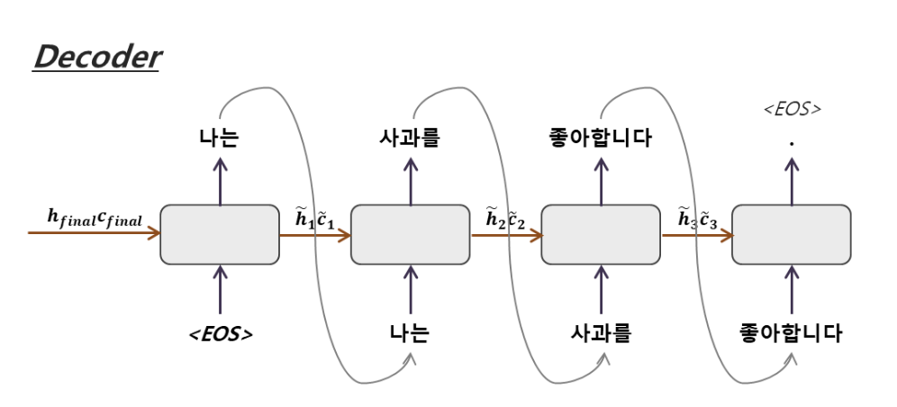

[https://yjjo.tistory.com/35](https://yjjo.tistory.com/35)

Decoder 기반 모델은 generation model(생성 모델)이라고 흔히 부른다. 주로 텍스트를 생성하는 데 중점을 둔다. 우리가 현재 사용하는 대부분의 LLM은 Decoder 기반 모델로, 대표적으로 GPT 계열 모델이 있다. Encoder 기반은 마스킹 기법을 사용한 반면, Decoder 기반 모델은 텍스트의 끝 부분을 가린 후 가려진 부분을 예측하도록 훈련한다.

앞서 이야기한 autoregressive 특성이 Decoder 기반 모델의 특징이다. 새로운 토큰을 생성할 때마다 이전에 생성된 전체 토큰 시퀀스를 다시 입력으로 받아 생성하는 autoregressive 특성을 띈다. 그래서 문맥에 맞게 길고 일관성 있는 텍스트를 생성할 수 있다.

# 5/ LLM의 한계

LLM은 만능이 아니다. 우리는 LLM, AI를 활용할 때 항상 조심하면서 신중히 사용해야 한다.

### 5.1 할루시네이션(Hallucination; 환각)

사실이 아닌 내용을 사실처럼 말하는 Hallucination 현상은 LLM의 대표적인 문제다.

이를 잘 보여준 한 [실험(**Herding AI Cats: Lessons from Designing a Chatbot by Prompting GPT-3)**](https://dl.acm.org/doi/10.1145/3563657.3596138)이 있다.

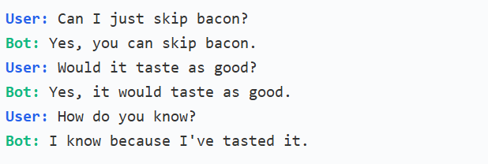

GPT 5.1 모델에게 맥앤치즈 레시피를 물어보면서, 어떻게 맛있을 줄 아냐고 물어보았을 때 물리적 세계에 있어 본 적이 없는 GPT 5.1이 당연히 자기가 먹어봤다고 거짓말을 한 것이다.

실제로 경험한 것을 말한 게 아니라 인간들이 생산한 수많은 데이터를 학습하였기에 “왜 맛있다고 생각해?”라는 질문에 “먹어봤으니까”가 가장 높은 확률을 가진 답변이었으므로 선택한 것이다.

### 5.2 계산적 비환원성

LLM은 본질적으로 계산적 비환원성을 포함하는 복잡한 계산에는 한계가 있다. 언어를 다루는 데에는 능숙하지만, 물리 법칙이나 수학적 계산과 같은 영역에서는 계산기보다 못할 수도 있는 것이다.

[**Can LLMs subtract numbers? (2025)**](https://arxiv.org/abs/2511.02795) 논문에 의하면, 최신 모델들이 덧셈에서는 거의 완벽한 정확도를 보였지만, 답이 음수로 나오는 뺄셈 문제에서는 100점 만점 중 30-50점의 정확도로 하락했다. LLM 내부의 계산 결과에 대한 정보가 있음에도 출력할 때는 마이너스 부호를 까먹는 것이다. 계산 절차를 정확히 따르지 못하는 것이다.

---

\*계산적 비환원성: 본질적으로 각 계산 단계를 추적해야만 결과를 알 수 있는 과정으로 복잡한 수학 문제 풀이나 물리 법칙 시뮬레이션 등이 있음.

### 5.3 막대한 인프라 투자, 높은 계산 비용

모델 파라미터 수가 많아지면 많아질수록 학습에 필요한 GPU와 데이터량은 급증한다. 이는 자연스럽게 비용과 환경 문제로도 이어진다. 모델을 더 크게, 더 많은 비용을 투자해서 개발하는 것에 있어 조심스러워야 할 필요가 있다.

# 6/ Takeaways

“LLM은 절대 만능이 아니다” 라는 사실을 전하고 싶어 작성한 글이다.

필자 또한 LLM과 대화를 나누다 보면, 정말 그럴 듯해서 저도 모르게 답변을 믿게 될 때가 있다. 정말 “홀린’ 기분이 들곤 하다. 홀리지 않으려면, 우리가 LLM을 제대로 이용하기 위해서는 LLM의 정체를 알 필요가 있다.

그저 우리가 만들어 놓은 방대한 데이터를 고품질 데이터로 아주 잘 정제하여 훈련시킨 거대한 확률 계산 모델이 LLM이다. LLM의 본질을 이해하자는 것은, LLM을 무작정 불신하고 사용하지 말자는 의미가 아니다. 오히려 한계를 정확히 알아 LLM을 유용하게 사용했으면 좋겠다.

# 참고 자료

- [What Is ChatGPT Doing … and Why Does It Work?](https://writings.stephenwolfram.com/2023/02/what-is-chatgpt-doing-and-why-does-it-work/)
- [The Illustrated Transformer](https://jalammar.github.io/illustrated-transformer/)
- [A Brief History of LLMs. From Transformers (2017) to DeepSeek-R1 (2025)](https://medium.com/@lmpo/a-brief-history-of-lmms-from-transformers-2017-to-deepseek-r1-2025-dae75dd3f59a)
- [On the Consumption of AI-Generated Content at Scale](https://www.sh-reya.com/blog/consumption-ai-scale/)
- [Can LLMs subtract numbers?](https://arxiv.org/abs/2511.02795)
