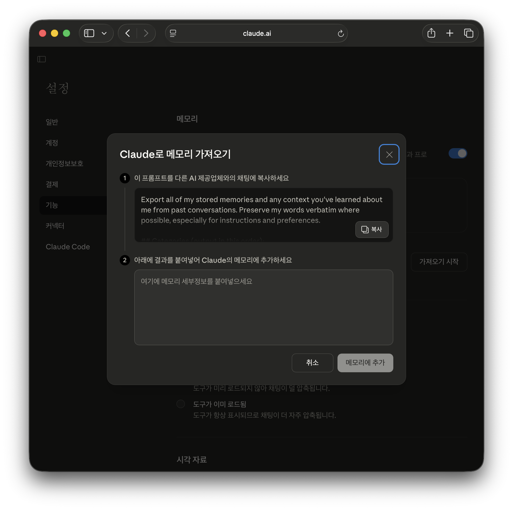
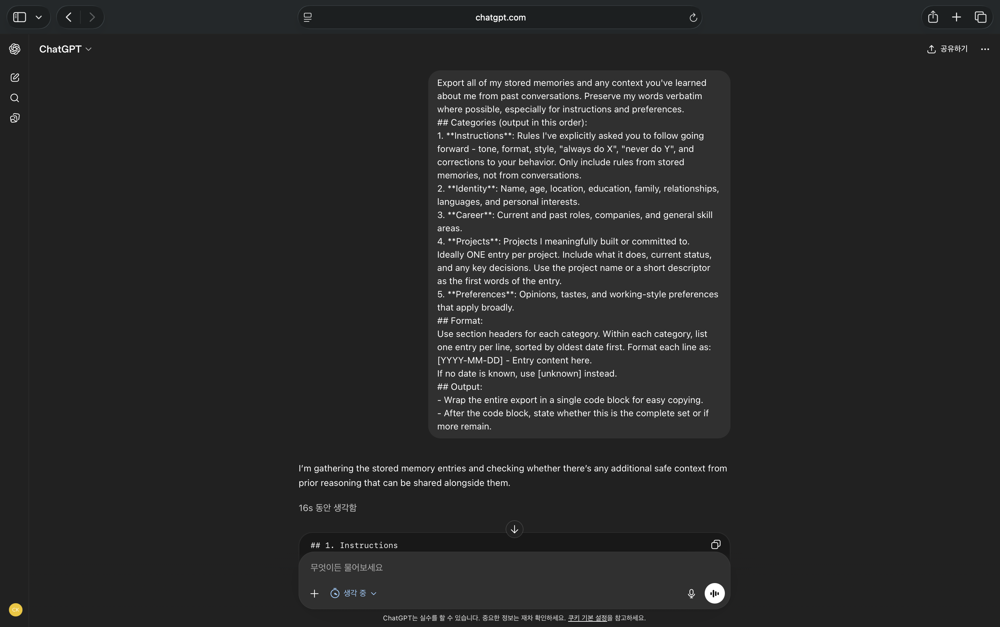
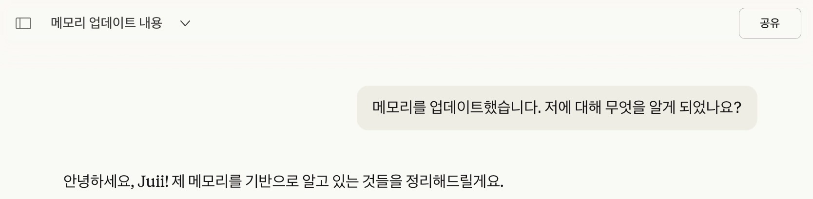

# 프롬프트로 ChatGPT에서 Claude로 메모리 가져오기

Created: March 18, 2026 6:31 PM
Upload: No

https://claude.com/import-memory

## 0/ 메모리

ChatGPT와 채팅하면, 새 채팅임에도 이전 대화를 기억하고, 사용자인 나의 선호도를 알고 있다. 채팅을 하면 할수록 나에 대해 잘 알게 되어 더 개인화된 경험을 하게 된다. ChatGPT가 출시되고 3년 넘게 사용하면서 나에 대한 메모리가 엄청 축적되어있기에, Claude와 Gemini를 사용하다 보면 나에게 엄청 최적화된 ChatGPT에 비해 불편함을 느낄 수밖에 없는 것 같다.

## 1/ Claude ‘다른 AI 제공업체에서 메모리 가져오기’ 기능

그런데 이번 3월에 Anthropic에서 프롬프트만으로 ChatGPT에서의 개인 메모리를 Claude로 옮길 수 있는 기능을 출시했다는 소식에 바로 사용해봤다! (ChatGPT 유저를 Claude로 옮기도록 노력하는 게 보이는 기능 같다.)



```html
Export all of my stored memories and any context you've learned about me from past conversations. Preserve my words verbatim where possible, especially for instructions and preferences.

## Categories (output in this order):

1. **Instructions**: Rules I've explicitly asked you to follow going forward — tone, format, style, "always do X", "never do Y", and corrections to your behavior. Only include rules from stored memories, not from conversations.

2. **Identity**: Name, age, location, education, family, relationships, languages, and personal interests.

3. **Career**: Current and past roles, companies, and general skill areas.

4. **Projects**: Projects I meaningfully built or committed to. Ideally ONE entry per project. Include what it does, current status, and any key decisions. Use the project name or a short descriptor as the first words of the entry.

5. **Preferences**: Opinions, tastes, and working-style preferences that apply broadly.

## Format:

Use section headers for each category. Within each category, list one entry per line, sorted by oldest date first. Format each line as:

[YYYY-MM-DD] - Entry content here.

If no date is known, use [unknown] instead.

## Output:
- Wrap the entire export in a single code block for easy copying.
- After the code block, state whether this is the complete set or if more remain.
```

프롬프트를 가볍게 보자면, Instructions, Identity, Career, Projects, Preferences  5가지 카테고리를 가져오고자 한다.

- **Instructions**
사용자가 주로 설정하는 답변 말투, 규칙 등.
- **Identity**
사용자의 기본 인적 사항
- **Career**
직업, 스킬 등
- **Projects**
진행하는 프로젝트의 내용과 현재 진행 상태
- **Preferences**
개인적인 취향, 업무 스타일

출력에는 [YYY-MM-DD] 날짜 태그를 붙여 언제 어떤 것을 했는지 메모리를 시간대별로 정리한다.

### ChatGPT에서 메모리 가져오고 Claude에 추가하기





ChatGPT에 위의 프롬프트를 복사 붙여넣기한 뒤 얻은 출력을 Claude의 메모리에 추가한 결과, 확실히 메모리 업데이트가 되긴 되었지만, 구체적인 내용까지는 무리라고 생각한다.
엄청 간단하면서 핵심만 업데이트하기에는 좋다고 생각한다.

## 3/ 메모리 활성화? 비활성화? 메모리 오염?

개인적으로 가끔은 메모리를 비활성화할 때 더 편한 경우도 있다. 새로운 프로젝트를 시작하거나, 기존과 다른 방식으로 시도해보고 싶을 때는 메모리를 일단 비활성화하고 시작한다. 가끔 나에게 너무 최적화되어 있는게 오히려 고집 부리는 모델 같다고 느끼기 때문이다. 혹은 메모리 업데이트를 한 뒤에 시작하는 게 좋은 것 같다.
채팅을 하다보면 자동으로 메모리가 쌓이게 되는데, 항상 핵심만 쌓인다는 보장도 없기 때문에 사용자가 스스로 메모리를 점검하는 것이 매우 중요한 것 같다.

자신의 상황에 맞게 적절하게 메모리 기능을 활용하는 게 좋을 것 같다. (개인정보 문제로 인해 메모리를 허용하지 않는 유저들도 많다. )
