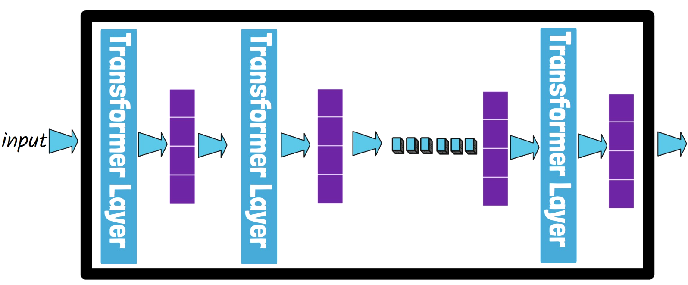
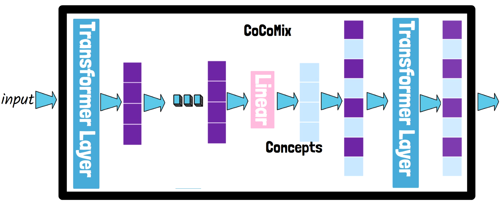
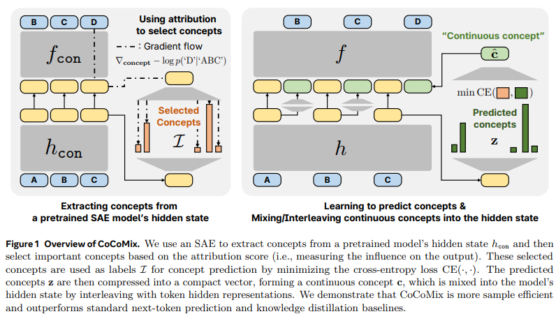
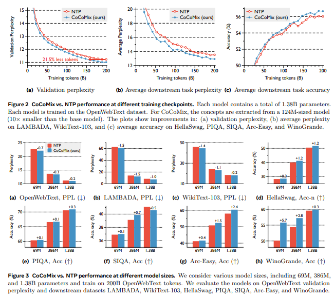
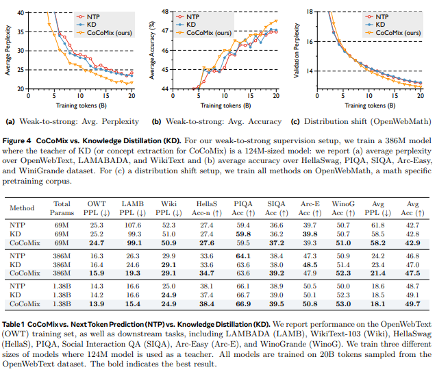
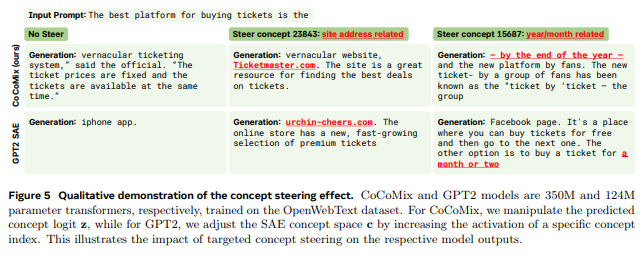

## **CoCoMix (Continuous Concept Mixing)**

next token prediction과 continuous concepts를 결합한 프레임워크.

- pretrained sparse autoencoder를 통한 concept 추출.
- continuous concept를 hidden state에 혼합
  → discrete language tokens 대신 continuous latent representations으로 대체하는 접근 방식.
  (LLM이 본질적으로 high-level concept과 reasoning 가정을 latent representations에 내재하고 있다는 것을 설명)

## 1/ Problem

- 일반적으로 LLM은 token-level에서 학습됨. 주어진 context에 따라 가장 적절한 next token을 예측하도록 학습 → `the`, `a`, `and` 등과 같은 기능어 (function words ↔ content words)처럼 피상적인 단어들이 있어 모델이 reasoning하기 위해서 (심층적인 의미 이해)는 많은 훈련이 필요함.

## 2/ Solution

SAE (Sparse Autoencoder)를 사용해 의미 있는 concept를 추출하고, 이를 모델의 hidden state에 결합. concept은 next token prediction에 직접적으로 기여하게 됨. (각 context에 대해 의미 있는 concept를 효과적으로 추출해 표현)

**기존 방식** - Next Token Prediction

**_CoCoMix_** - Next Token Prediction + Continuous Concept Prediction

- **Target concept selection using attribution**
  추출된 concept들은 개별적으로 input에 어느 정도 영향을 미치는지 평가하기 위해 attribution score (i.e. measuring the influence on the output)를 사용해 가장 중요한 concept 선택.

- **Predicting the selected concepts**
  선택된 concept은 모델의 hidden state로부터 예측되며, 이때 Cross-Entropy Loss를 최소화하며 학습. (기존 next token prediction loss와 concept prediction loss를 조합해 최적화)

- **Mixing continuous concepts with token embeddings**
  예측된 연속 concept들을 압축해 하나의 “연속 concept” (compact vector)을 형성하고, hidden state에 interleaving (끼워 넣기) → token과 연속 concept이 함께 모델의 예측에 기여하게 됨.

- CoCoMix는 예측된 concept을 직접 분석하고 수정할 수 있는 기능을 제공해 유저가 모델의 reasoning 과정을 쉽게 이해할 수 있음 (직접적으로 생성 결과에 영향을 미칠 수 있는 기능)

## 3/ Concept Prediction Loss

$$
\mathcal L_{concept}(a_t) = \frac{1}{K_{attr}} \sum_{i \in \mathcal I} CE(z_t, i)
$$

$a_t$ - attribution score

$h_t = h(\mathbf x)_t \in \mathbb R^d$ - input $\mathbf x$에 대한 모델이 생성한 hidden state

$M( \cdot )$ - linear prediction head

$z_t = M(h_t) = Wh_t + b \in \mathbb R^C$ - model outputs (logit)

context 정보를 갖고 있는 hidden state representation (고차원 벡터)를 선형 변환해 $C$차원의 concept space에 투영해 각 concept별 logit 값 계산.

$\mathcal I = \{i_1, ... , i_{K_{attr}}\}$ - 상위 $K_{attr}$ 개념들의 index 집합.

## 4/ Continuous Concept Vector

concept prediction할 때 단일 concept이 아니라 여러 개의 concept을 한 번에 예측하고, 이를 하나의 연속적인 벡터로 압축.

그래서 단순 확률 값으로 사용하는 것이 아니라 학습 가능한 벡터 형태로 변환해 hidden state와 결합.

$$
\hat c_t = W \cdot \text{TopK}(z_t) + b
$$

$\hat c_t \in \mathbb R^d$ , $W \in \mathbb R^{d \times C}$, $b \in \mathbb R^d$ (TopK-sparse vector를 $d$-dimensional embedding에 투영)

- **Top K Activation**
  concept prediction logit $z_t$를 희소화 (sparsify)해 가장 중요한 concept만 선별.
- continuous concept vector $\hat c_t$로 압축
- $\hat c_t$를 $h_t$와 결합해 함께 전달.

### Training objective

기존 Next Token Prediction loss + Concept Prediction loss

$$
\sum^{T-1}_{t=1} - log f(x_{t +1} | h_{\leq t}, \hat c {\leq t}) + \lambda \mathcal L_{concept}(a_t)
$$

$f(x_{t +1} | h_{\leq t}, \hat c {\leq t})$ - 모델이 예측한 확률 분포에서 다음 토큰 $x_{t+1}$이 등장할 확률
(CE Loss를 통해 예측 분포와 실제 분포 차이를 최소화)

$\lambda$ - a tunable hyperparameter (concept prediction loss의 비중 조절)

## 5/ Architecture

## 6/ Results

- sample efficient (적은 데이터로도 비슷한 수준의 성능 달성 가능)
- 기존 NTP (Next Token Prediction)보다 능가
- weak-to-strong supervision 시나리오에서도 성능 개선.
  weak supervision은 불완전한 label을 기반으로 학습하는 반면, strong supervision은 명확하고 정확한 label을 사용해 모델 훈련.
- CoCoMix는 작은 모델에서 추출한 concept을 활용해 큰 모델을 훈련해, 불완전한 정보를 활용해도 효과적인 성능 향상

기존 NTP 모델과 비교했을 때 Perplexity가 더 낮은 것을 확인할 수 있음

CoCoMix는 21.5% 더 적은 tokens를 사용함에도 기존 NTP 모델과 동일한 수준의 성능을 보여줌

KD (Knowledge Distillation) - Teacher model의 지식을 Student model에 전이하는 방법

_유사점_ - pretrained model (SAE)에서 의미 있는 개념을 추출해 base model 학습에 활용했기 때문.

_차이점_ - 기존 KD는 확률 기반 학습을 했다면, CoCoMix는 concept 기반 학습을 수행해 weak-to-strong supervision을 가능하게 함 (작은 모델에서 추출한 개념으로 더 큰 모델을 훈련할 수 있다는 것을 입증)

- 기존 KD - “해당 토큰이 등장할 확률 몇 %인지” 같은 확률 자체를 그대로 학습
- CoCoMix - “해당 문장에서 중요한 개념이 무엇인지” 같은 concept를 학습한 후, hidden state에 결합

## 7/ Interpretability (해석 가능성) & Steerability (제어 가능성)

CoCoMix vs. GPT2-SAE (GPT2에 SAE concept space 추가)

결론적으로 해석 가능성 증가함.

- 모델이 어떤 개념에 더 집중하는지 분석 가능.
- 예측 개념의 activation을 조절해 (특정 개념 조정)
  특정 개념을 반영하도록 조절할 수 있음.
  ’site’를 강조하면 ‘site’와 관련되도록 생성하는 등 더 의미 있는 결과를 얻을 수 있음.

## 8/ Future Work

현재는 pretrained SAE를 사용해 의미 있는 개념을 추출하고 다시 학습하는 방식이지만,
향후에는 모델 자체적으로 연속 개념을 학습하는 방법 연구할 계획을 보임.
Knowledge Distillation 없이도 개념을 직접 학습하고자 함.

## Reference

- [CoCoMix: LLM Pretraining with Continuous Concepts (Arxiv)](https://arxiv.org/pdf/2502.08524)

- [GitHub - facebookresearch/RAM/projects/cocomix](https://github.com/facebookresearch/RAM/tree/main/projects/cocomix)

- [AI Papers Academy - CoCoMix](https://aipapersacademy.com/cocomix/)
