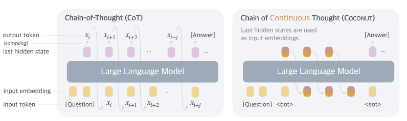
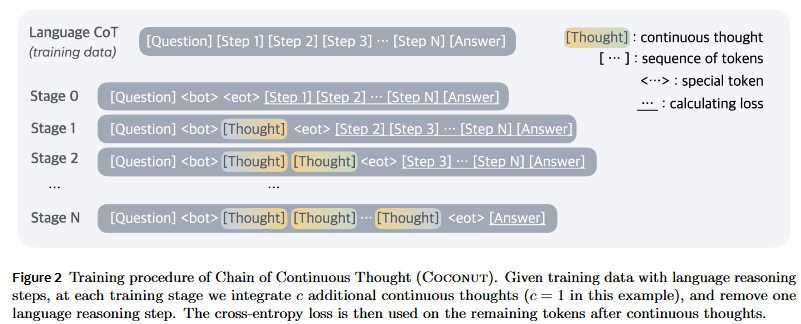
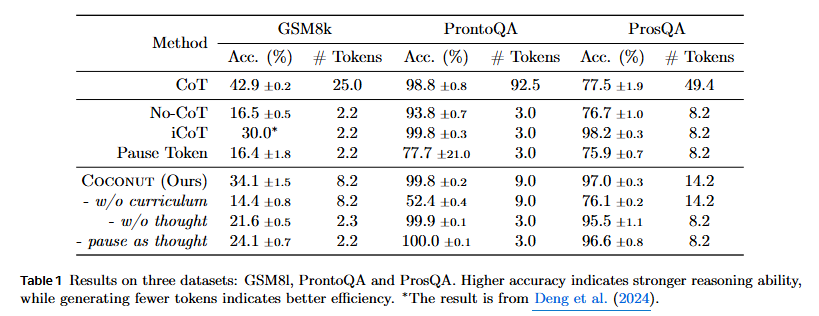
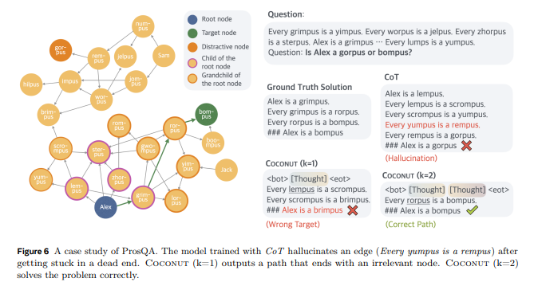
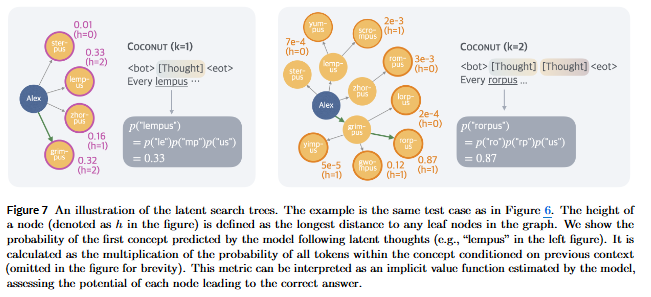
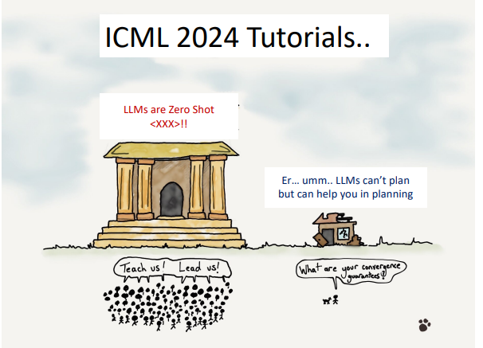

## 1/ Chain-Of-Thought (CoT)

**CoT 한계**: LLM의 reasoning이 텍스트 형태로 생성되어야 한다는 점은 제약을 가할 수 있다.

Neuroimaging 연구에 의하면 언어 이해 및 생성을 담당하는 인간 두뇌 영역이 추론 과정 중에는 비활성화된다고 함. 이는 언어는 communication에 적합할 뿐 복잡한 문제 해결에는 불필요하다는 것을 시사한다.

인간이 추론 중에 생각을 언어로 바꿔야 할 필요가 없는 것처럼 AI도 마찬가지이다. (인공지능이 인간을 따라한다는 것이 많이 느껴지는 부분) → LLM도 language space 대신 latent space에서 reasoning을 수행할 필요가 있다.
모델이 생성하는 대부분의 tokens는 텍스트의 일관성을 유지하는 데 필요할 뿐 실제로 추론에 크게 기여하지 않는다.

언어 제약 없이 자유로운 추론이 가능하도록. 필요할 때만 결과를 언어로 번역할 필요가 있다.

본 연구는 word-based reasoning의 제약에서 벗어나 LLM이 continuous latent space에서 추론해야한다고 제안한다. 해당 method를 CoCoNUT (Chain of Continuous Thought)라고 부른다.

## 2/ CoT vs CoCoNUT (Chain of Continuous Thought)

CoT는 추론 과정을 word token sequence로 생성하는 반면, CoCoNUT는 last hidden state를 reasoning state(continuous thought)로 표현하여 next input embedding으로 직접 이용한다.

→ LLM이 language space가 아니라 제약이 없는 latent space에서 추론할 수 있도록 한다.

## 3/ CoT Method

question → LLM에 input tokens로 embedding되어 input.

→ response의 첫 번째 token을 받음 (추론 과정 시작), 해당 token은 last hidden state에서 가져옴. (즉, backbone Transformer의 마지막 레이어의 출력)

→ forward pass 반복, 현재 stage까지 가진 reasoning process tokens과 question을 공급

## 4/ Coconut Method

language mode에서 latent thought mode로 변경.

모델은 기본 language model로 작동하면서 next token을 생성.

latent mode에서 last hidden state를 next step의 input으로 사용.

last hidden state는 current reasoning state를 나타내고, 이를 ‘continuous thought’라고 함.

`<bot>` special token + question \*`<bot>` : latent thought mode 시작

→ question을 처리하고 last hidden state를 생산 (이전에는 language token으로 바꿨는데, 여기서는 아님)

대신 hidden state가 다시 모델에 input embedding으로 question의 embeddings와 special token과 함께 들어간다.

→ 반복

→ 반복하면서 점점 더 많은 thought tokens를 input으로 활용

→ `<eot>` special token 사용 \*`<eot>` : latent thought mode 종료 및 language mode 시작

## 5/ Training

continuous latent space에서 추론하는 법을 LLM에게 어떻게 훈련할까?

Stage 0에서 모델은 thought tokens를 생성하지 않는다다. CoT samples으 답을 맞추도록, reasoning traces를 생산하도록 훈련되어 있을 뿐이다.

그 이후 각 stage에서 sample로부터 하나의 reasoning step을 제거하고, 대신에 thought tokens을 넣는다. (한한 개의 singe reasoning step 대신 한 개의 thought tokens이 각 stage에 추가, hyperparametr `c`로 컨트롤)

\*c : 한 번의 추론 단계에서 생성할 수 있는 thought (continuous embeddings)의 개수

각 stage마다 남아 있는 reasoning steps과 answer에 관해서만 loss 계산한다. (thought token는 loss 계산 안함) 각 pass마다 새로운 latent thought를 계산하고, 남아 있는 text sequence에 대해서 loss를 얻는다.

loss objective는 continuous thought가 language thought를 압축하기보다 reasoning의 예측 능력을 향상시키는 데 집중한다. 그러므로 모델이 human language와 비교했을 때 더 효율적인 표현을 배울 수 있다.
language tokens를 생성할 필요 없이 내부적으로 계속 추론할 수 있도록 한다.

## 6/ Switching

모델은 언제 latent thought mode에서 language mode로 바뀌는지 어떻게 알까?

- 모델이 latent thoughts에 기반해 binary classifier 사용을 결정하는 것을 내버려두기
- latent thoughts의 일정한 수를 사용

두 전략 모두 유사한 결과를 보여줬지만, 단순성을 이유로 constant number of thoughts를 택한다.

## 7/ Results

GPT-2를 기본 모델로 사용.

- No-CoT 대비
  모든 데이터셋에서 성능 우세
- CoT 대비
  수학 (GSM8k; 초등학 수준 수학 문제) 은 CoT가 더 우세. 그러나 CoT는 Coconut에 비해 더 많은 tokens를 필요로 함. → Coconut이 훨씬 효율적.
  ProsQA와 같이 단계적 사고가 더 필요한 데이터셋에서 우세.
- i-CoT (추론 가정을 다른 방법으로 내부화하려는 방법) 대비
  유사하나 수학은 coconut이 더 우세. 그러나 i-CoT는 더 적은 tokens 사용

w/o curriculum는 multi-stage tranining의 중요성을 보여준다.

### 8/ BFS-like Reasoning

ProsQA 데이터셋과 같은 planning-intensive task에서 Coconut이 CoT보다 우세한 결과를 보여준다.

CoT는 추론 중 hallucinated edge를 생성해 잘못된 결과를 도출했고, Coconut은 thought tokens를 사용해 BFS와 비슷하게 여러 경로 탐색한다. thought token를 하나 사용할 때는 오답이지만, 두 개를 사용할 때는 더 많은 경로를 찾고 올바른 답 도출한다.
단일 경로가 아니라 여러 경로를 통해 탐색한다는 점에 BFS와 비슷하다.

## 9/ Takeaways

Auto mode에서는 LLM은 planning을 하지 못한다.

CoT, ReACT (Reasoning + Acting)

사람이 계속 프롬프트를 수정하는 과정에서 모델이 정답을 맞추는 것과 같은 Clever Hans 효과가 발생할 수 있다.

\*Clever Hans : LLM 자체 검증 및 개선 능력이 부족하여 논리적으로 문제 해결하는 것이 아니라 프롬프트, 즉 shallow heuristic에 의존하면서 답을 내놓는 것.

[Clever Hans or Neural Theory of Mind? Stress Testing Social Reasoning in Large Language Models](https://arxiv.org/abs/2305.14763)

(다만 해당 논문에서 4o, o1은 없는 점 참고해야 할 것 같다... N-ToM;Neural Theory of Mind과 같이 인간 수준의 정서적 추론 능력을 모방하기 위해서는 아직 개선이 필요..?)

## Reference

[Training Large Language Models to Reason in a Continuous Latent Space](https://arxiv.org/abs/2412.06769)

[facebookresearch/coconut](https://github.com/facebookresearch/coconut)

[Chain of Continuous Thought (AIPapers Academy)](https://aipapersacademy.com/chain-of-continuous-thought/)

[메타의 코코넛(COCONUT): 언어 없이 생각하는 AI 방법 (AI넷)](https://www.ainet.link/17963)
