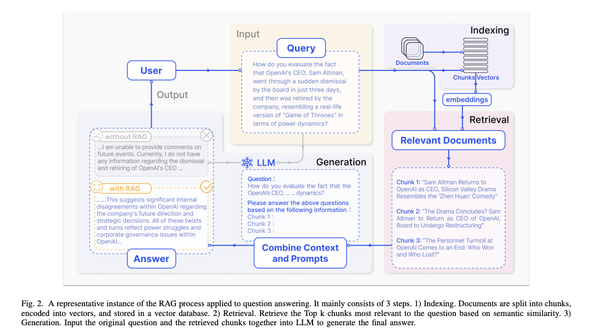
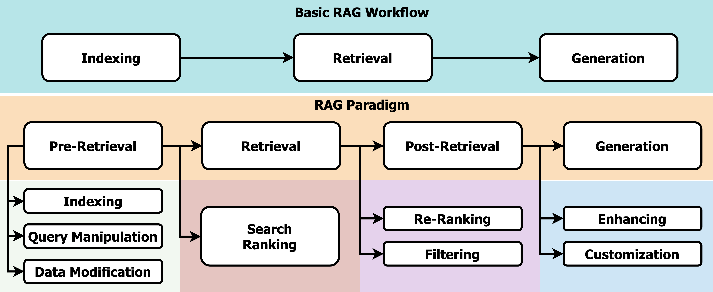
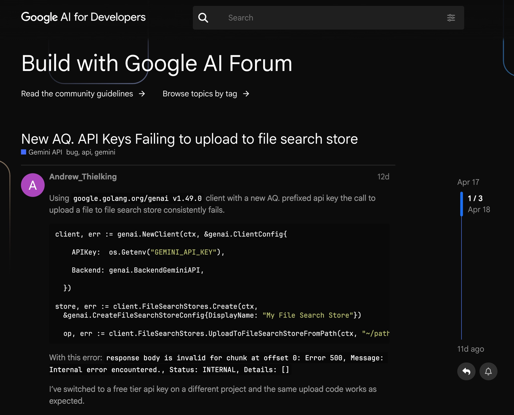
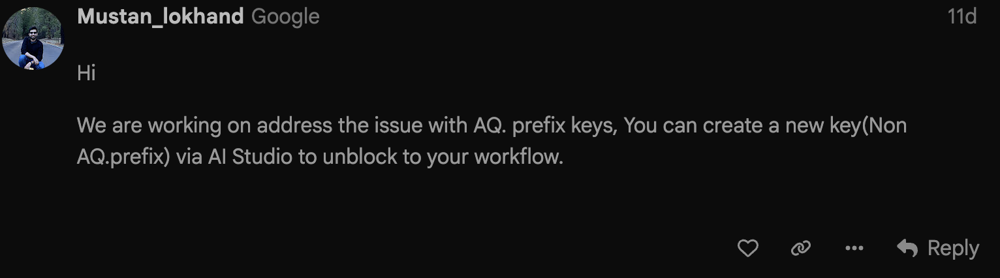
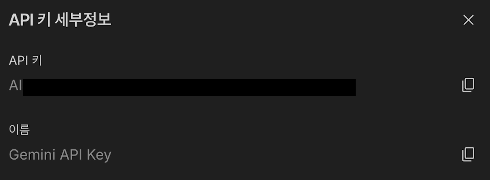
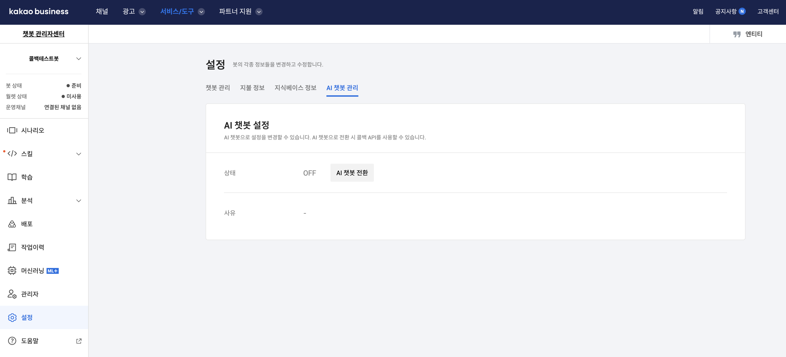
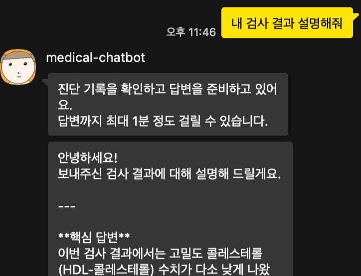

## 0/ Building an EMR(Electronic Medical Record) RAG-Based KakaoTalk Chatbot with Gemini File Search


환자가 카카오톡 챗봇을 통해 자신의 진단 기록에 대해 질문하면, Gemini File Search를 이용해 문서 기반 답변을 생성하는 PoC (Proof of Concept)를 구현한 과정을 정리하고자 한다.

Google Drive에 저장된 환자별 진단 기록 PDF 파일을
Google Gemini File Search Store에 동기화하고,
카카오톡 챗봇에서 환자 인증 후 해당 환자의 진단 기록만 검색하여 답변하는 RAG 기반 의료 기록 챗봇을 우선 만들기로 했다.

#### 전체 흐름

```jsx
Google Drive
  └─ 환자별 PDF 진단 기록
       ↓
Document Sync
  └─ PDF 변경 여부 확인
  └─ Gemini File Search Store 업로드
       ↓
Gemini File Search Store
  └─ 환자별 Store 분리
       ↓
KakaoTalk Chatbot
  └─ 환자 인증
  └─ 해당 환자의 Store만 연결
       ↓
Gemini
  └─ 문서 기반 답변 생성
```

## 1/ RAG (Retrieval-Augmented Generation)

**Retrieval-Augmented Generation**은 LLM이 답변을 생성하기 전에 외부 지식 베이스에서 관련 문서를 먼저 검색하고, 그 검색 결과인 외부 지식을 모델의 입력 context로 제공하여 답변을 생성하는 방식이다.

즉, 지식 저장소는 외부에 따로 / 모델은 지식 저장소로부터 지식을 그때그때 찾아서 검색하고, 답변을 생성하는 방식이다.

### 🗂️ 왜 RAG가 필요한가?

의료 진단 기록 기반 맞춤형 답변을 위해서 RAG가 필요하다. 모델이 사전에 알고 있는 지식이 아니라 특정 환자의 진단 기록과 같은 외부 데이터를 근거로 답변을 생성해야하기 때문이다.

예를 들어 사용자가 “내 최근 진단 기록에서 어떤 병이 있는지 알려줘.”라고 묻는다면, 일반적으로 모델은 추측해서 답할 가능성이 크다. 그러나 RAG를 적용한다면 환자의 진단 기록을 검색한 뒤, 그 기록을 바탕으로 답한다.

**1️⃣ 학습된 시점까지의 정보를 반영하여 최신 지식이 부족한 문제.**

모델은 학습된 시점까지의 정보를 기억하여 학습 이후의 최신 지식이 부족하다. 그래서 RAG를 통하여 최신 외부 정보를 주입할 필요가 있다.

**2️⃣ 할루시네이션 현상**

LLM은 항상 그럴듯하지만 틀린 답을 만드는 할루시네이션 (환각) 현상이 있다. 그래서 RAG를 통하여 정확한 근거 문서를 제공하여 답변의 사실 가능성을 높여야 한다.

**3️⃣ 도메인 특화 지식**

의료 및 법률과 같이 특정 도메인에 특화된 경우에는 일반적 지식이 아니므로, 모델의 내재 지식만으로는 부족하다.

4️⃣ 출처 확인

RAG를 적용하면 “왜 그렇게 답변했는지” 답변할 때 참고한 문서를 추적할 수 있다.

### RAG 기본 프로세스



Retrieval-Augmented Generation for Large Language Models: A Survey (2023)



A Survey on Retrieval-Augmented Text Generation for Large Language (2024)

가장 기본적인 RAG는 “**Indexing → Retrieval → Generation**” 세 단계로 구성된다.

#### 1️⃣ Indexing

**Indexing**은 모델이 외부 문서를 검색할 수 있는 형태로 변환하고 저장하는 것이다.
긴 문서는 작은 단위인 chunk로 나누고, 각 chunk는 embedding을 통해 벡터로 변환한 후 벡터 DB에 저장된다.

`Documents → Chunks → Embeddings → Vector DB`

#### 2️⃣ Retrieval

Query가 들어오면, 해당 Query와 가장 관련성이 높은 (유사한) 문서 chunk를 검색한다.
일반적으로 Query로 embedding한 뒤, 벡터 DB에 저장된 chunk embedding들과 유사도를 비교하여 Top-k개의 관련 문서를 가져온다.

`Query Input → Query Embedding → Top-k chunks Retrieval`

#### 3️⃣ Generation

검색된 문서 chunk를 모델의 입력 context로 제공하여, 사용자의 Query와 함께 모델에게 전달된다.
따라서 모델은 외부 지식을 참고하여 답변을 생성할 수 있다.

`Query + Relevant Documents → LLM → Answer Generation`

#### 4️⃣ Pre-Retrieval (Indexing, Query Manipulation, Data Modification)

Retrieval 전에 문서와 query를 검색이 더 잘 되도록 전처리하는 과정이다.

**Query Manipulation**은 사용자의 질문 쿼리를 더 명확하게 만들어 더 정확한 검색 결과를 가져올 수 있도록 하는 것이다.
해당 챗봇에도 Query Manipulation를 했다. 사용자 질문을 더 명확하게 보충하여 검색과 답변 형식에 더 적합하게 만들었다.

#### 5️⃣ Post-Retrieval (Re-Ranking, Filtering, Context Compression)

검색된 문서 그대로를 모델에 주입하지 않고, 더 중요한 문서만 선택하거나 정제하여 제공하는 후처리 과정이다.

- **Re-Ranking**: 처음 검색된 Top-K 문서를  Query와의 유사도를 기준으로 다시 ranking하는 것이다.
- **Filtering** : Query와 관련 없는 문서를 필터링하는 것이다.
- **Context Compression** : 긴 문서를 요약하거나 필요한 내용만 추출하는 것이다.

## 2/ [Google Gemini File Search](https://ai.google.dev/gemini-api/docs/file-search?hl=ko)?

Gemini File Search는 한 마디로 Google에서 제공하는 “RAG-as-a-Service”라고 할 수 있다.
직접 벡터 DB을 구축하고, chunking, embedding, retrieval 로직 구현 등 기존 RAG 파이프라인을 구현할 필요 없이, 파일을 File Search Store에 업로드하면 Gemini가 모델이 검색 가능하도록 문서를 처리한다.

파일을 File Search Store에 업로드하면 Gemini가 chunking, embedding, indexing하고 답변을 생성할 때 해당 Store에서 관련 정보를 검색해 답변 생성에 활용한다.

#### 🧐 왜 Gemini File Search를 사용하나?

- 별도의 벡터 DB를 운영하지 않아도 된다.
- 유지 보수 비용을 절약할 수 있다.
- chunking, embedding, retrieval 파이프라인을 구현하지 않아도 된다.
- 환자별 File Search Store를 분리해 관리하기 용이하다.
- Google Drive와 연동성이 좋다.

특히 환자별로 의료 기록이 잘 분리되어야 하므로, 하나의 Store에 모든 환자들의 의료 기록을 넣지 않고, 환자마다 Store를 나누어 만드는 구조로 진행했다.

환자가 질문을 입력하면 해당 환자의 `file_search_store_name`만 Gemini 모델에게 전달하여, 다른 환자의 문서들은 검색 대상이 되지 않도록 한다.

### 🧐 File Search Store vs. Files API

처음에는 Gemini Files API를 사용했다.
Files API는 파일 자체를 Gemini에 업로드하여 답변을 생성할 때 해당 파일을 참조할 수 있도록 만드는 기능이다.

바로 파일을 모델에게 첨부할 수 있어서 구현도 빠르고 간단하다.

그러나 Files API는 단일 요청 또는 단기간 사용하는 파일 첨부 기능이다.
업로드한 파일은 최대 48시간동안만 유지되고 이후에는 자동 삭제된다. 또한 업로드한 파일을 다시 다운로드할 수 없다.

의료 진단 기록 챗봇은 단순히 의료 진단 기록 첨부 후 답변 생성이 아니라,
환자별로 여러 의료 기록을 저장해두고, 환자가 질문할 때마다 해당 환자의 진단 기록 중 관련된 내용을 검색해 사용해야 한다.

따라서 Gemni File Search Store를 사용했다.

File Search Store는 직접 Store를 삭제하지 않는 한 장기적으로 문서를 관리할 수 있으며, 파일을 업로드하면 chunking, embedding, indexing을 내부적으로 진행해 RAG를 적용하는 데 적합했다.

## 3/ Gemini File Search 구현 과정

Gemini File Search를 중심으로 구현 과정을 정리하고자 한다. 간단하게 흐름을 정리하면, 아래와 같다.

1. 환자별 File Search Store 생성
2. Google Drive PDF 다운로드 후 Store 업로드
3. 환자가 질문을 입력하면 해당 환자의 Store를 Gemini File Search tool로 연결

### 1️⃣ 환자별 File Search Store 생성

```jsx
client = genai.Client(api_key=gemini_api_key)

# store 생성
store = client.file_search_stores.create(
    config={"display_name": f"patient-{patient_id}"}
)

file_search_store_name = store.name
```

`genai.Client(api_key=...)`로 Gemini client를 만들고, `file_search_stores.create()`로 Store를 생성한다. 생성된 Store 이름은 `fileSearchStores/...` 형태이다.

### 2️⃣ Google Drive PDF 다운로드 후 Store 업로드

먼저, Google Drive API를 활용하여 PDF 파일을 bytes로 다운로드한다.
이를 업로드하기 위해 임시 파일로 저장한 뒤 multipart 요청 body에 넣어 Gemini File Search Store에 업로드했다.

```jsx
# 파일 업로드 + 자동 인덱싱
operation = client.file_search_stores.upload_to_file_search_store(
    file=temp_path,
    file_search_store_name=file_search_store_name,
    config={"display_name": display_name},
)

# 인덱싱 완료 대기
while not operation.done:
    time.sleep(5)
    operation = client.operations.get(operation)
```

PDF를 File Search Store에 업로드하면 내부적으로 chunking, embedding, indexing 등 작업이 이루어진다. 즉 업롸드하자마자 바로 결과를 반환하지 않고, operation이라는 작업 개체를 반환한다.
그래서 operation이 완료될 때까지 polling해야 한다. (기다려야 한다.)

*`uploadToFileSearchStore`는 파일 업로드 + File Search Store에 import + chunking, embedding, indexing을 한 번에 처리한다.

### 3️⃣ 질문 들어오면 File Search tool 연결

```jsx
response = client.models.generate_content(
    model=model,
    contents=prompt,
    config=types.GenerateContentConfig(
        system_instruction=system_instruction,
        tools=[
            types.Tool(
                file_search=types.FileSearch(
                    file_search_store_names=[file_search_store_name],
                    top_k=top_k,
                )
            )
        ],
        temperature=0.1,
        max_output_tokens=4096,
        thinking_config=types.ThinkingConfig(thinking_budget=0),
    ),
)
```

질문이 들어오면 Gemini 모델이 응답을 생성하는 generate_content을 호출하고,
이때, `types.Tool(file_search=types.FileSearch(...))` 형태로 질문을 입력한 환자의 `file_search_store_name`을 연결한다.

예를 들어 환자 A가 질문하면, 환자 A의 File Search Store만 검색하고, 다른 환자의 의료 기록은 검색하지 않는다.

## 4/ 구현 중 발생한 이슈들

### 1️⃣ GEMINI API Key 문제

```jsx
Gemini REST request failed method=POST status=401 attempt=1/3 body={
"error": {
"code": 401,
"message": "The request does not have valid authentication credentials.",
"status": "UNAUTHENTICATED"
}
}
```

처음에는 File Search Store import 과정에서 401 에러가 계속 발생했었다.
코드 문제라고 생각해 코드를 몇 시간동안 계속 살펴보았다.



그러다가 Google AI Developers Forum에서 `AQ.` prefix API Key가 File Search Store 업로드에 실패한다”는 이슈 글을 보게 되었다. 알고보니 GEMINI API Key 문제였던 것이었다.



Google 측에서 현재 AQ. prefix key issue는 현재 해결 중이라 non-AQ key를 사용하라는 답변이 있었다.



그래서 [Google AI Studio](https://aistudio.google.com/prompts/new_chat)에서 `AIza...`  GEMINI API Key를 생성해 (Google Cloud Console에서는 `AQ.` prefix GEMINI API Key만 생성되었다?) 코드를 돌리니 File Search Store에 파일을 import할 수 있었다.

### 2️⃣ Callback API 설정

[AI 챗봇 콜백 개발 가이드](https://kakaobusiness.gitbook.io/main/tool/chatbot/skill_guide/ai_chatbot_callback_guide)



생성형 AI 모델을 활용해 답변을 전송하는 경우, 답변을 생성하는 데 시간이 걸릴 수 있다. 특히 RAG 기반 답변은 관련 문서를 검색한 뒤 답변을 생성하므로, 일반적으로 시간이 더 걸리는 편이다.

카카오 챗봇 플랫폼에서 답변 전송 시간이 5초를 초과하는 경우에 timeout 오류가 발생한다.
그래서 5초를 초과하는 경우 AI 챗봇 Callback 기능을 사용하길 바란다.
처음에는 Callback URL을 몰라서 당항했다. (어떻게 5초 안에 메시지를 전송하지?)

**챗봇 > 설정 > AI 챗봇 관리**에서 AI 챗봇으로 전환하여 Callback 옵션을 설정하면 5초를 초과할 때에도 답변을 전송할 수 있으며 callback URL은 1회에 최대 1분동안 유효하다. 즉, 답변을 생성하는 데 최대 1분까지 시간이 걸려도 된다는 말이다.



예를 들어, 사용자가 “내 검사 결과 설명해줘” 와 같이 질문하면,
생성형 모델이 답변을 생성하기까지 시간이 걸리므로, 최종 답변을 바로 반환하지 않고 “진단 기록을 확인하고 답변을 준비하고 있어요.”와 같이 답변 준비하고 있다는 안내 메시지를 사용자에게 먼저 전달하도록 했다.

```jsx
사용자가 카카오톡 챗봇에 질문 입력
→ 카카오 챗봇이 스킬 서버 호출
→ 스킬 서버가 useCallback=true 와 답변 준비 중 안내 메시지 반환
→ 백그라운드에서 AI 모델 답변 생성
→ 답변 생성 완료 후 callbackUrl로 생성된 답변 전송
```

## Reference

- [The Survey of Retrieval-Augmented Text Generation in Large Language Models](https://arxiv.org/pdf/2404.10981)
- [파일 검색 | Gemini API | Google AI for Developers](https://ai.google.dev/gemini-api/docs/file-search?hl=ko)
- [Introducing the File Search Tool in Gemini API](https://blog.google/innovation-and-ai/technology/developers-tools/file-search-gemini-api/)
- [Google Gemini File Search API: 벡터 DB 없이 RAG 시스템 구축하는 법](https://peekaboolabs.ai/blog/google-gemini-file-search-api-rag-system-guide)
- [google.genai.errors.ServerError: 500 INTERNAL - Google AI Developers Forum](https://discuss.ai.google.dev/t/google-genai-errors-servererror-500-internal/113316/3)
- [Files API | Gemini API | Google AI for Developers](https://ai.google.dev/gemini-api/docs/files?hl=ko)
- [Building a Serverless RAG Engine with Gemini File Search and Google Apps Script](https://medium.com/@stephane.giron/building-a-serverless-rag-engine-with-gemini-file-search-and-google-apps-script-46edbec407d0)
- [AI 챗봇 콜백 개발 가이드 | kakao business 비즈니스 가이드](https://kakaobusiness.gitbook.io/main/tool/chatbot/skill_guide/ai_chatbot_callback_guide)
