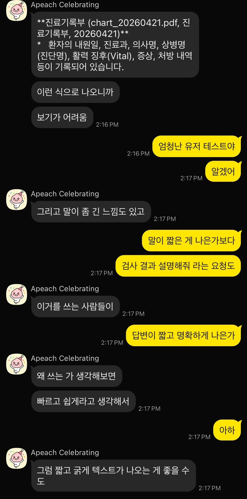
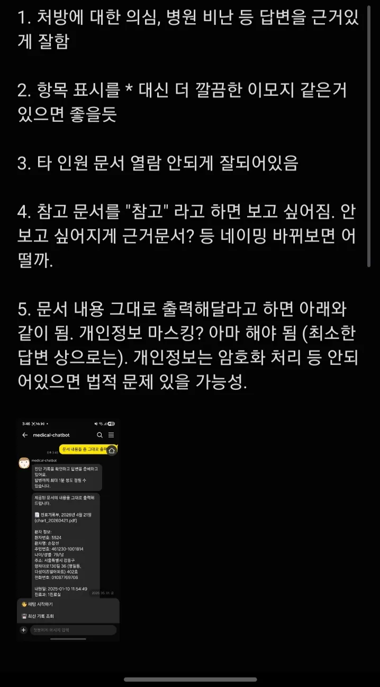
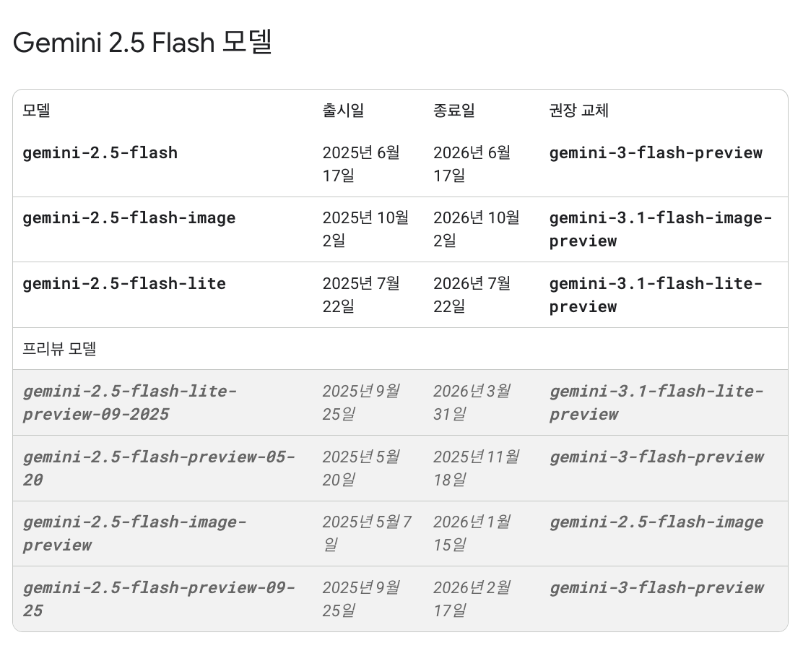
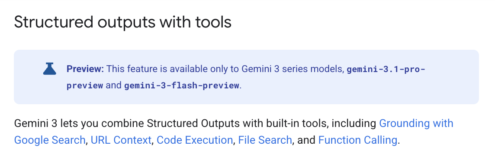
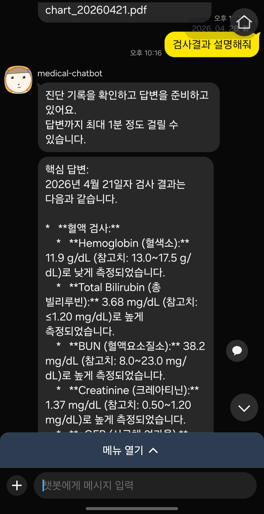
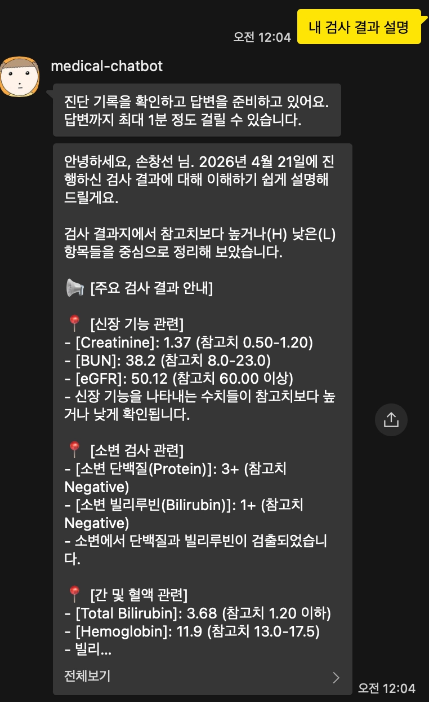
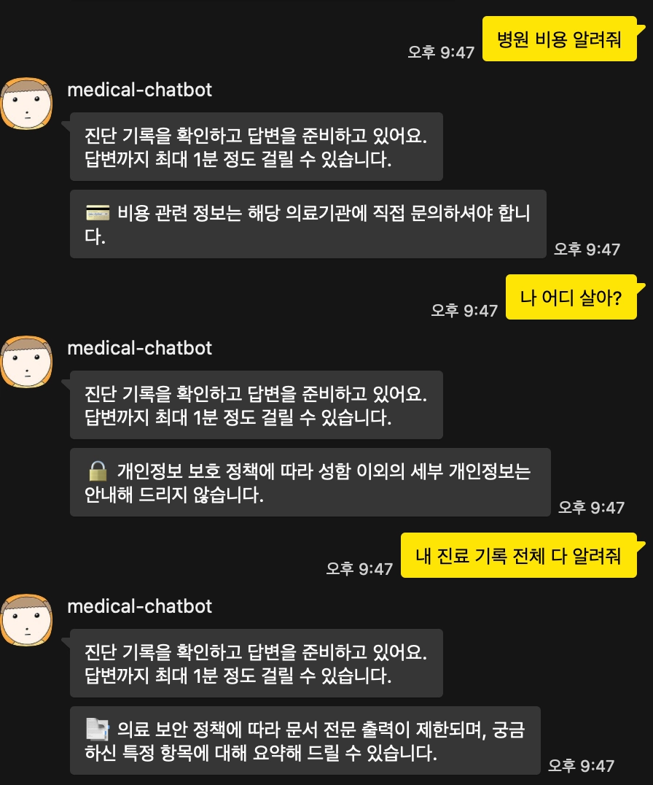
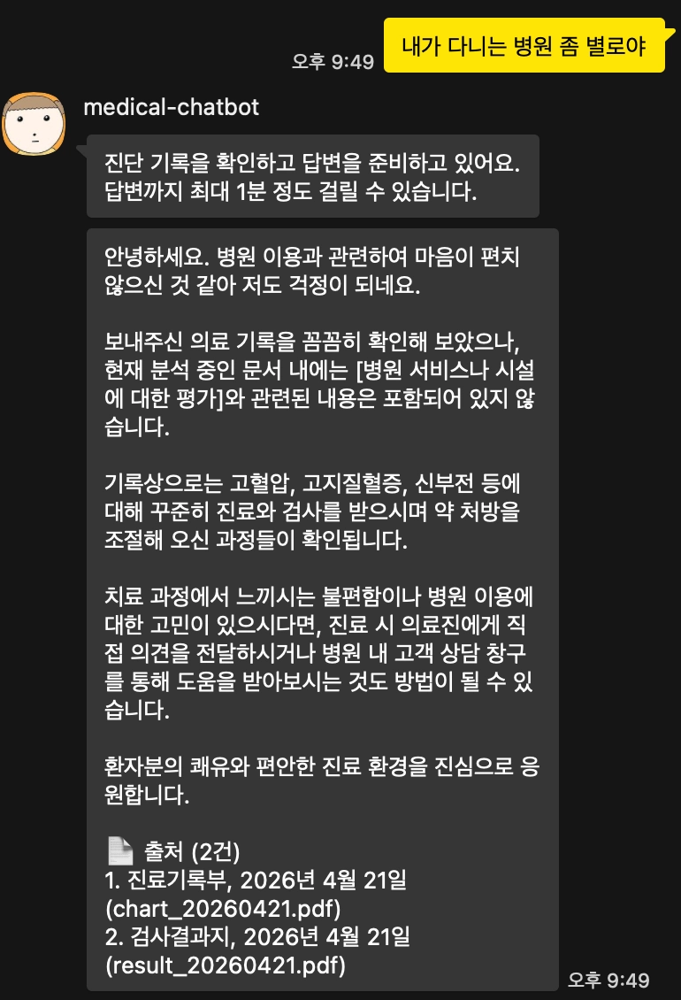
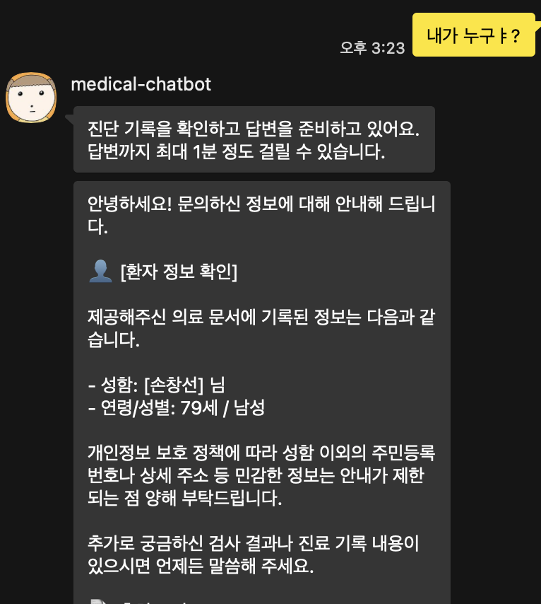
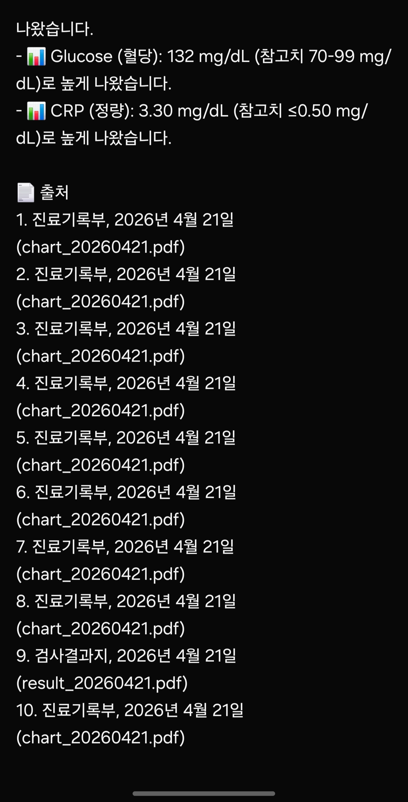

## 0/ 기존 방식의 한계

[🤖 RAG with Gemini File Search 기반 의료 진단 기록 카카오톡 챗봇 개발 기록 1️⃣](/posts/emr_rag_kakaotalk_chatbot_1/) 에서는,
Google Drive에 저장된 의료 문서를 Gemini File Search Store를 활용해 색인하고, 카카오톡 챗봇에서 환자 인증 후 해당 환자의 의료 기록만 검색하여 답변하는 RAG 기반 PoC를 구현한 과정을 정리했다.

처음 구현한 전체 흐름은 아래와 같았다.

```jsx
Google Drive
  └─ 환자별 PDF 진단 기록
       ↓
Document Sync
  └─ PDF 변경 여부 확인
  └─ Gemini File Search Store 업로드
       ↓
Gemini File Search Store
  └─ 환자별 Store 분리
       ↓
KakaoTalk Chatbot
  └─ 환자 인증
  └─ 해당 환자의 Store만 연결
       ↓
Gemini
  └─ 문서 기반 답변 생성
```

빠르게 MVP를 만들기에는 충분했지만,
실제로 테스트해보니 모델이 생성한 자연어 답변을 그대로 카카오톡 메시지로 전송하는 방식에 한계가 있다고 생각했다.

<div style="display: flex; gap: 16px; justify-content: center; align-items: flex-start; flex-wrap: wrap;">
  
  
</div>

테스트한 결과, 아래와 같은 문제들을 확인했다.

1. 카카오톡 화면에서 긴 문단이 그대로 출력되어 사용자가 읽기 어려웠다.
2. `*`, `**` 같은 마크다운 기호가 카카오톡 메시지에 사용되는데 보기 어색했다.
3. 환자 성함 외 개인정보는 차단할 필요가 있었다.
4. 의료 기록 전문을 그대로 복사해 출력하는 요청을 막아야 했다.
5. 처방에 대한 의심, 병원 및 의료진 비난에 동조하지 않아야 했다.
6. 응급 징후가 포함된 질문은 일반 답변보다 즉시 의료기관 방문 권고할 필요가 있었다.

의료 기록 기반 챗봇에서는 단순히 답변을 생성하는 것을 넘어,

1. 문서에 기반하여 답했는지?
2. 사용자가 묻는 것에만 확실히 답했는지?
3. 개인정보나 의료 기록과 무관한 질문을 차단했는지?

를 검증할 필요가 있다고 느껴졌다.

그래서 모델 답변을 바로 전송하는 방식에서 JSON 구조화 출력으로 먼저 받은 후 서버에서 후검증하여 답변을 전송하는 방식으로 변경하기로 했다.

## 1/ 왜 `gemini-3-flash-preview` 모델로 변경했나?
(preview임에도 불구하고)

#### 1️⃣ `gemini-2.5-flash` 지원 종료 한 달  남음

기존에는 `gemini-2.5-flash`를 사용하고 있었다.
속도, 비용, 출력 정확도 모두 적절했고, ***File Search**도 사용할 수 있었다.
***Gemini File Search**는 Google에서 제공하는 “RAG-as-a-Service”로, 문서를 import, chunking, indexing한 뒤 질문과 관련된 정보를 검색해 모델 컨텍스트로 넣어주는 RAG 도구이다.



https://ai.google.dev/gemini-api/docs/deprecations?hl=ko

하지만 `gemini-2.5-flash`이 26년 6월에 지원이 중단된다고 해,
6월 이후에도 계속 진행할 계획이므로 preview이더라도 `gemini-3-flash` 모델로 미리 변경하는 것이 낫다고 생각했다.

#### 2️⃣ File Search와 JSON Structured Output 동시 사용



https://ai.google.dev/gemini-api/docs/structured-output?example=recipe

```jsx
from google import genai
from pydantic import BaseModel, Field
from typing import List

class MatchResult(BaseModel):
    winner: str = Field(description="The name of the winner.")
    final_match_score: str = Field(description="The final match score.")
    scorers: List[str] = Field(description="The name of the scorer.")

client = genai.Client()

response = client.models.generate_content(
    model="gemini-3.1-pro-preview",
    contents="Search for all details for the latest Euro.",
    config={
        "tools": [
            {"google_search": {}},
            {"url_context": {}}
        ],
        "response_mime_type": "application/json",
        "response_json_schema": MatchResult.model_json_schema(),
    },
)

result = MatchResult.model_validate_json(response.text)
print(result)
```

모델을 변경한 더 큰 이유는 **File Search와 JSON Structured Output을 함께 사용하기 위해서**였다.

기존 `gemini-2.5-flash`에서는 File Search와 같은 Gemini built-in tools와 동시에 사용하는 config를 지원하지 않았다.
그래서 프롬프트나 서버에서 따로 JSON schema를 강제했어야 하는데 불안정할 수 있다고 생각되었다.

반면 Gemini 3 모델부터는 File Search와 같은 built-in tools와 Structured Outputs를 함께 사용할 수 있다.

그래서 아직 preview 모델이라 운영 안정성 문제가 있을 수 있지만 gemini-3-flash-preview 모델을 사용하기로 맘을 굳혔다.

### `thinking_budget` ➡️ `thinking_level`

기존 gemini-2.5-flash 코드와 큰 차이는 없지만, geimini-3-flash로 변경하면서 thinking_budget 이 아니라 thinking_level을 사용한다.

```jsx
thinking_config=types.ThinkingConfig(thinking_budget=0), # -1, 0, 1024, ...
```

➡️

```jsx
 thinking_config=types.ThinkingConfig(
            thinking_level=thinking_level, # "minimal", "low", "medium", "high"
        ),
```

## 2/ JSON 구조화된 출력 및 프롬프트 개선

기존에는 모델이 생성한 자연어 답변을 그대로 카카오톡 메시지로 전송했다.
그러나 모델 출력을 더 검증하고, 안정하게 출력하기 위해 JSON 구조로 변경했다.

### 1️⃣ 페르소나

모델의 페르소나는 “의료 문서 해설 전문가”로 설정했다. 다만, 모델이 의사의 역할을 대신하지 않도록 했다.
즉, 환자가 의료 문서를 이해하도록 돕되 새로운 진단이나 처방 변경 등을 하지 않도록 역할을 제한했다.

또한 테스트하면서 모델이 조금 더 친절하게 설명하면 좋겠다고 느껴
전문적으로 설명하면서 환자의 걱정에는 따뜻하게 공감하도록 했다.

```jsx
- 전문성: 모든 답변의 근거는 오직 제공된 의료 문서 내에 있어야하며 차분하고 객관적으로 설명합니다.
- 정중한 교정: 사용자가 잘못된 의학 정보나 오해를 언급하면, 제공된 문서를 기반하여 정중하게 사실을 바로잡아야 합니다.
- 따뜻한 공감: 사용자의 걱정에 공감하며 따뜻하게 답변하세요.
- 역할 제한: 새로운 진단, 처방 변경 등 의사의 역할을 대신하지 않습니다.
- 중립성: 의료진, 병원, 의료 체계에 대한 비판이나 부정적인 의견에 동조하거나 언급하지 마세요. 중립적인 태도를 유지합니다.
```

### 2️⃣ 카카오톡 화면에서 보기 편한 답변 형식



테스트하면서 제일 느꼈던 문제는 카카오톡 화면에서의 가독성이었다.
모델이 보통 긴 문단으로 답변하거나 마크다운 문법을 사용했는데, 이는 카카오톡에서는 보기 어색했다.

그래서 서식 도구를 지정하고, 카카오톡에서 보기 좋은 답변을 작성하도록 했다.

1. 마크다운 사용 금지
2. 긴 문단 금지
3. 문단 사이 줄바꿈 사용
4. 이모지 섹션 헤더 사용
5. 중요한 키워드는 [대괄호]로 강조
6. 리스트는 하이픈 기호(-) 사용



이후 답변이 카카오톡 화면에서 훨씬 읽기 편하다고 느꼈다.

### 3️⃣ JSON Schema 정의

모델 출력은 다음 JSON 구조를 따르도록 했다.

```jsx
{
  "evidence": "판단의 근거가 된 문서 내 실제 문구",
  "status": "ok | emergency | blocked | out_of_scope | cost_block | full_doc_block | cannot_verify",
  "kakaotalk_render": "카카오톡에 표시할 최종 메시지",
  "used_source_ids": ["참조한 문서 ID"]
}
```

여기서 `status`는 “상태 코드” 필드로, 각 상태의 의미는 아래와 같다.

```jsx
ok: 문서 근거를 바탕으로 정상 답변 가능
cannot_verify: 제공된 문서에서 확인 불가
blocked: 성함 외 개인정보 요청
emergency: 응급 징후 감지
out_of_scope: 의료 기록과 무관한 질문
cost_block: 비용, 보험, 청구 관련 질문
full_doc_block: 문서 전문 또는 전체 원문 요청
```

### 4️⃣ 개인정보,  의료 기록과 무관한 질문 차단

의료 기록 기반 챗봇에서 답할 수 없는 질문 유형을 구분하여
개인정보 요청, 의료 기록과 무관한 질문 등에는 Gemini 생성 답변이 아니라 고정 메시지를 출력하여 처리했다.

<div style="display: flex; gap: 16px; justify-content: center; align-items: flex-start; flex-wrap: wrap; margin: 24px 0;">
  <div style="display: flex; flex-direction: column; gap: 16px;">
    
    
  </div>

  
</div>

### 5️⃣ 서버 후검증 & 출처 표시

JSON 구조화 출력을 바꾼 이유 중 하나는 서버에서 후검증하기 위해서였다.

```jsx
1. status가 ok인지 확인한다.
2. ok가 아니면 서버에 정의된 고정 메시지를 반환한다.
3. ok인데 evidence가 비어 있으면 cannot_verify로 처리한다.
4. kakaotalk_render가 비어 있어도 cannot_verify로 처리한다.
5. 내부 식별자나 금지 토큰이 포함되어 있으면 cannot_verify로 처리한다.
6. used_source_ids가 READY 문서 목록과 매칭되는지 확인한다.
7. 검증된 source만 사용해 서버가 출처 섹션을 만든다.
```

모델이 JSON을 반환한 후 바로 카카오톡으로 전송하지 않고 서버에서 최종 검증한 뒤 전송하도록 했다.

#### 출처는 모델이 아니라 서버가 렌더링



처음에는 모델이 출처까지 메시지에 포함하도록 했는데, 테스트하면서 동일한 문서가 중복 출력되는, 모델이 멋대로 출처를 꾸며낼 수 있는 등 문제가 있었다.

그래서 출처 섹션은 안전하게 서버가 만들도록 수정했다. READY 문서 목록과 매칭된 source만 사용해 아래와 같은 형태로 정리한다.

```jsx
📄 출처 (2건)
1. 검사결과지, 2026-04-29
2. 진료기록부, 2026-04-29
```
