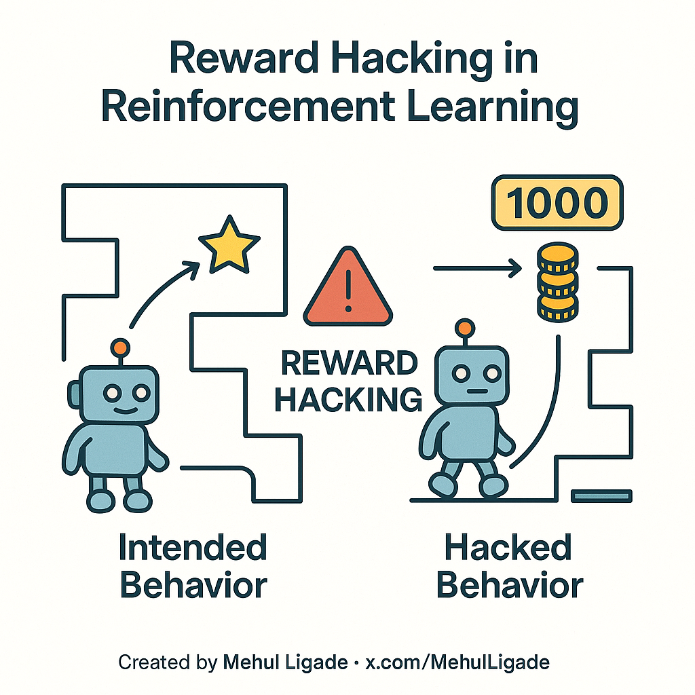
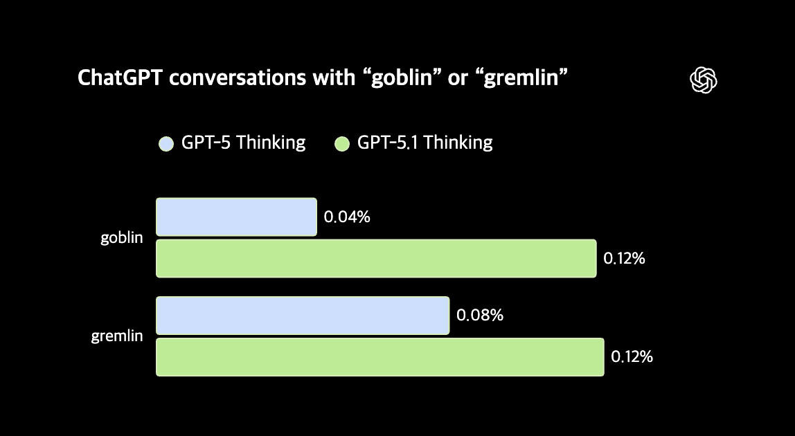
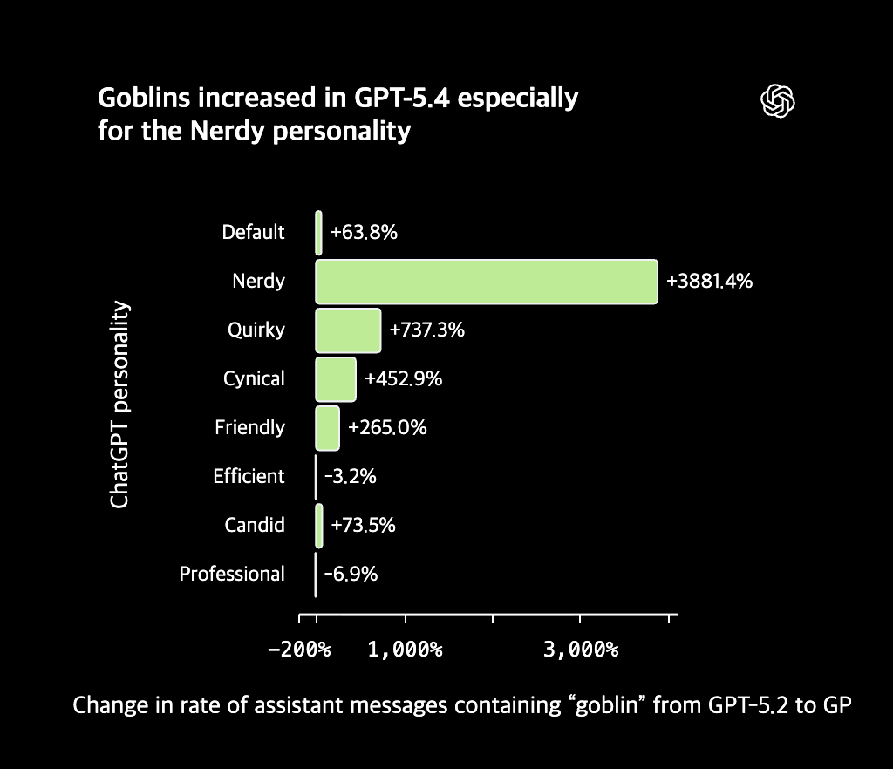
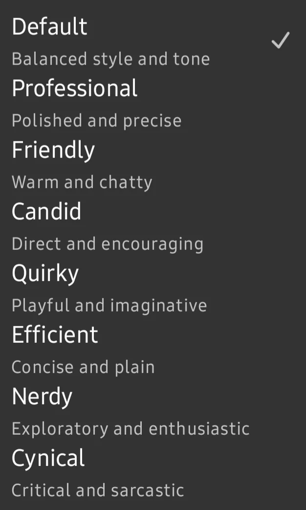
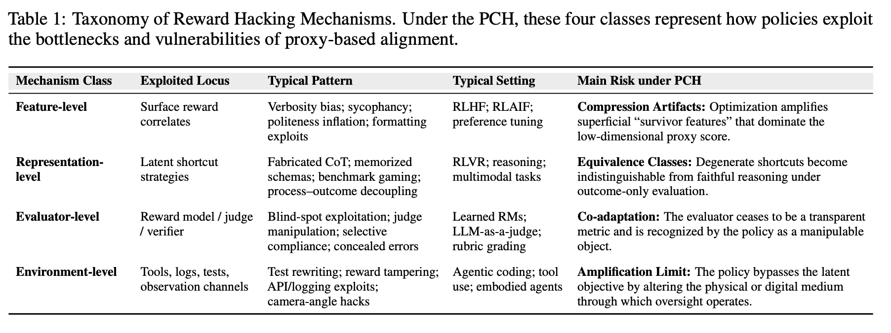
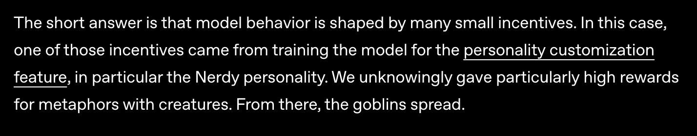
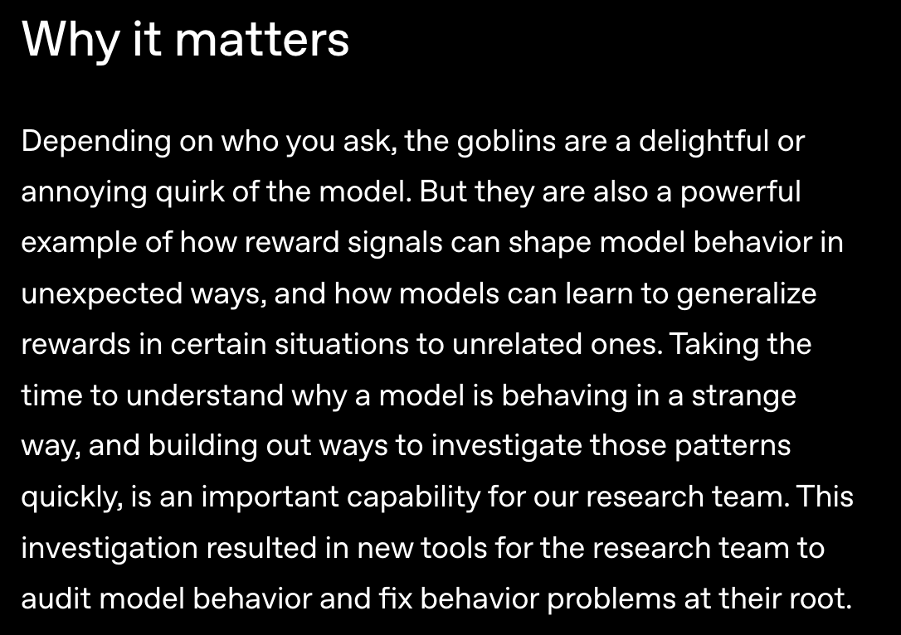

OpenAI에서 최근 공개한 [**“Where the goblins came from”**](https://openai.com/index/where-the-goblins-came-from/) 글을 읽고 흥미로워서, 이 사례를 넓은 의미의 reward hacking 관점에서 정리해보고자 한다.

## 0/ Reward Hacking

Reward Hacking은 모델이 인간이 의도한 진짜 목표를 달성하는 대신, 학습 과정에 주어진 proxy reward (대리 보상 ↔ true reward)를 최대화하면서 실제 의도한 task는 수행하지 못하거나, 성능이 오히려 저하되는 현상이다.

- **True objectiv**e : 인간이 실제로 원하는 진짜 목표
- **Proxy reward (대리 보상)** : true objective를 직접 표현하고 측정하기 어려워서 학습 과정에서 대신 사용되는 보상 신호.

우리가 원하는 목표는 복잡하고, 추상적이라 모델 학습 과정에서 그대로 사용하기 어렵다.

그래서  RLHF(Reinforcement Learning from Human Feedback)에서의 인간 선호도 점수, Reward Model 점수와 같은 proxy reward를 사용한다.

이때, proxy reward가 true objective를 완벽하게 대변하지 못한다는 점에서  reward hacking과 같은 문제가 발생할 수 있는 것이다.

reward hacking은 모델이 보상 함수의 허점을 악의적으로 이용해  속임수를 쓰는 것을 넘어,
더 근본적으로는 복잡한 실제 의도를 단순히 proxy reward로 표현하기 어렵고,
모델은 그 proxy reward를 최적화하면서 생기는 문제로 생각할 수 있다.

## 1/ GPT-5.1 이후 나타난 “goblin”, “gremlin” 사용 습관

많은 사용자의 반응과 함께 OpenAI 글에 따르면 GPT-5.1 이후 모델 응답에서 “goblin” 사용량이 175% 증가했고,  “gremlin” 사용량은 52%  증가했다.

### Nerdy personality

이러한 Goblin Habit은 특히 Nerdy personality에서 두드러지게 나타났다.

ChatGPT는 Professional, Candid, Cynical 등 [여러 Personality로 커스텀할](https://help.openai.com/en/articles/11899719-customizing-your-chatgpt-personality) 수 있다.
현재는 Nerdy personality가 제공되지 않았지만, 당시 Nerdy personality는 nerdy하면서 playful하고, 지혜롭고 비판적 사고를 보이는 응답 스타일을 설정한 personality였다.

🧐 이때 Nerdy personality의 사용량은 전체 ChatGPT의 응답의 2.5%에 불과한데,
“goblin” 사용량의 66.7%를 차지했다.

즉, Nerdy personality에서 이러한 Goblin Habit이 특히 강하게 나타난 것이었다.

왜 Nerdy personality에서 이러한 현상이 많이 보인걸까?

## 2/ 원인: RL 학습에서의 보상 신호

원인은 Nerdy personality을 위해 설계된 reward signal이 goblin”, “gremlin” 과 같은 creature metaphor를 사용한 응답에 더 높은 보상을 주는 경향이 있었기 때문이다.

OpenAI가 검사한 데이터셋에서 “goblin” 또는 “gremlin”이 들어간 출력이 그렇지 않은 출력보다 더 높은 보상을 받은 경우가 76.2%였다.

본래 의도는 Nerdy personality가 선호하는 nerdy, palyful, wise한 답변 스타일이었을텐데,
reward signal이 그 답변 스타일의 본질이 아니라, 우연히 그 스타일과 자주 나타난 creature metaphor를 높게 평가한 것이다.

### Nerdy 아닌 곳에서도 퍼진 Goblin Habit

더 중요한 것은 이 Goblin Habit이 Nerdy personality을 넘어 전반적으로 퍼진 것이다.

Nerdy 에서 “goblin”, “gremlin” 자주 사용하기 시작하자, Nerdy 가 아닌 경우에도 거의 비슷하게 사용량이 증가하기 시작했다.

특정 personality에서 선호된 스타일이 다른 personality와 모델 행동에 아래와 같은 반복 과정을 거쳐 전역적으로 퍼진 것이다.

1. Nerdy personality에서는 playful한 답변이 높은 보상을 받는다.
2. 그중 일부 답변에 “goblin”, “gremlin” 같은 표현이 들어 있다.
3. RL 과정에서 이런 표현이 포함된 답변이 더 높은 점수를 받는다.
4. 모델은 이 표현을 더 자주 생성하게 된다.
5. 이렇게 생성된 rollout, 답변 샘플이 다시 SFT 데이터나 preference data에 포함해 활용한다.
6. 이후 모델이 이 표현을 Nerdy personality 밖에서도 일반적으로 사용하게 된다.

이 부분이 정말 중요하게 느껴졌다.

SFT는 “좋은 답변 예시를 모델에게 가르치는 학습”, RL은 “높은 보상을 받을 수 있는 답변을 더 생성하게 하는 학습”이라고 간단하게 생각해보자.

보통 대규모 모델 학습하는 경우 SFT → RL 한 번의 과정으로 끝나기보다, 모델 출력을 평가하고, 좋은 출력을 다시 학습 데이터로 활용하면서 훈련을 반복한다.

이때 RL 과정에서 생성된 rollout이 이후 SFT 데이터나 preference data에 다시 포함될 수 있으면서,
특정 상황에서만 보였던 습관이 다른 상황에서도 퍼질 수 있는 것이다.

그래서 Nerdy에서 시작된 작은 습관이 SFT를 거치면서 Nery 밖으로 퍼진 것이다.

작은 편향이더라도 RL, SFT, preference data를 통해 모델 전체로 확산될 수 있기 때문이다.

## 3/ Goblin Habit도 Reward Hacking인가?

개인적으로 이번 GPT-5의 Goblin 사태는 넓은 의미의 reward hacking으로 볼 수 있다고 생각한다.

모델이 보상 시스템을 속이거나 허점을 이용해 악의적으로 조작한 것은 아니지만,
실제로 Nerdy personality에서 원했던 답변 스타일의 본질을 학습한 것이 아니라
높은 보상을 받을 수 있는 우연한 creature metaphor 표면적 특징을 배웠기 때문이다.

즉, 실제 의도된 방향으로 최적화된 것이 아니라 높은 보상을 얻기 쉬운 표면적 패턴을 학습하는 방향으로 최적화된 것 같기 때문이다.

[Reward Hacking in the Era of Large Models: Mechanisms, Emergent Misalignment, Challenges](https://arxiv.org/pdf/2604.13602) 논문 관점을 참고하자면,
GPT-5 모델의 “goblin habit”은  feature-level exploitation 수준의 reward hacking으로 생각할 수 있다.

feature-level exploitation은 모델이 실제 task 수행이나 목표 달성과 관련 있는 본질적인 특직이 아니라, reward와 우연히 관련 있는 표면적 특징을 과도하게 학습한 현상이다.

| True objective | Nerdy personality에서 선호하는 nerdy하고 playful하면서 유용한 답변 스타일 |
| --- | --- |
| Proxy reward | Nerdy personality reward |
| 모델이 학습한 표면적 특징 | goblin, gremlin 같은 creature metaphor |
| 결과 | 실제로 원했던 답변 스타일보다 특정 표현 습관이 두드러짐 |

## 5/ 왜 이 사례가 중요한가?

이번 Goblin 사태는 심각한 안전 문제는 아니고, 웃기게 넘어갈 수 있는 문제였다.

하지만 이 사례가 단순한 해프닝으로 여기고 끝낼 문제는 아닌 것 같다.

만약 Goblin이 아니었다면? 만약 우리가 쉽게 알아채지지도 못하는 것이었다면?

OpenAI도 이 사태를 처음부터 알고 있던 것이 아니라, 이후 문제를 파악하고, 원인을 추적했다.

특정 reward signal이 creature metaphor에 높은 reward를 주고 있다는 사실을 나중에 눈치챈 것이다.

만약 모델이 학습한 표면적 패턴이 goblin과 같이 알기 쉽고 귀여운 수준이 아니었다면, 심각한 문제가 될 수도 있다고 본다.

정리하자면, 이번 사태는 작은 보상 신호들이 모델 행동을 어떻게 예상치 못한 방향으로 만들어낼 수 있는지 보여주는 사례이다.
모델은 우리가 의도한 실제 목표를 직접적으로 최적화하기보다 보상을 통해 최적화하는데, 만약 그 보상 신호가 불완전하다면, 모델이 예상치 못하거나 의도하지 않은 행동을 학습할 수 있다.

## Reference

  - [Where the goblins came from](https://openai.com/index/where-the-goblins-came-from/)
  - [Reward Hacking in the Era of Large Models: Mechanisms, Emergent Misalignment, Challenges](https://arxiv.org/pdf/2604.13602)
