## 0/ Harness Engineering

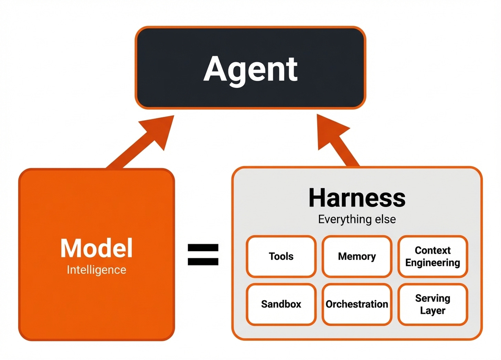

Harness는 모델을 둘러싼 모든 외부 환경으로, 시스템 프로프트, 파일 시스템, 모델 라우팅, 외부 도구 등 모델 바깥에서 동작하는 시스템 전체를 의미한다.
(모델이 🐴 말이면 harness는 말이 마차를 잘 끌 수 있도록 사용하는 마구.)

2026년 2월, [Mitchell Hashimoto](https://mitchellh.com/)가 자신의 블로그 글에서 agent가 실수할 때마다 같은 실수를 하지 않도록 시스템을 설계하는 작업을 “Harness Engineering”라 부른다고 했고, 이어서 OpenAI가 [“Harness engineering: leveraging Codex in an agent-first world”](https://openai.com/ko-KR/index/harness-engineering/?utm_source=chatgpt.com) 공식 글을 공개하면서 (+ [Claude Code 내부 코드가 유출되면서](https://zainhas.github.io/blog/2026/inside-claude-code-architecture/)) Harness Engineering 용어가 빠르게 대중화되었다.

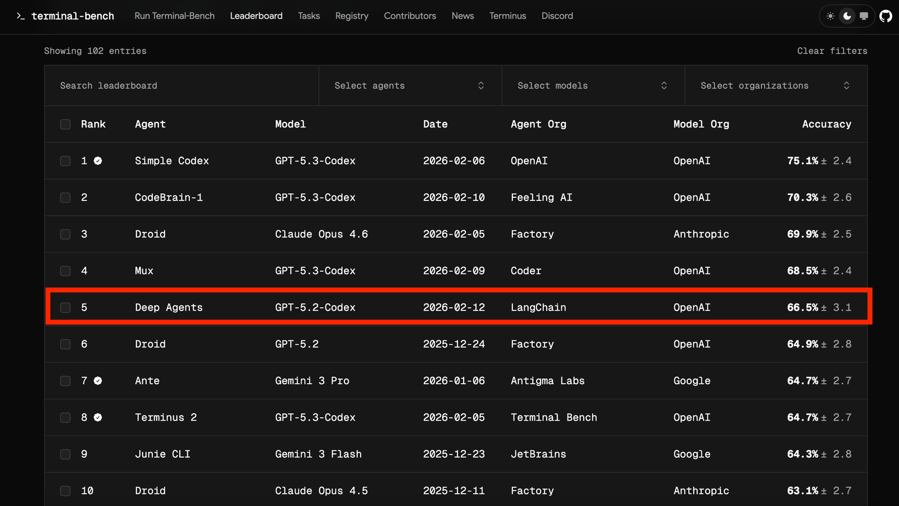

[“Agent = Model + Harness”](https://martinfowler.com/articles/harness-engineering.html?utm_source=chatgpt.com) 라고 표현할 정도로 Harness의 중요성이 무척 강조되고 있다.
실제로 LangChain에서 terminal 기반 에이전트 평가 벤치마크인 [Terminal-Bench 2.0](https://www.tbench.ai/leaderboard/terminal-bench/2.0)에서 모델(`GPT-5.2-Codex`)은 그대로 사용하고, 모델을 감싸는 환경인 Harness만 개선했더니 당시 리더보드 순위가 30위권에서 5위까지 올라갔었다.

이와 같이, 단순히 모델의 성능을 넘어 Harness를 효과적으로 설계하는지, 이른바Harness Engineering이 agent의 성능을 좌우한다고 할 수 있다.

## 1/ Harness > Context > Prompt

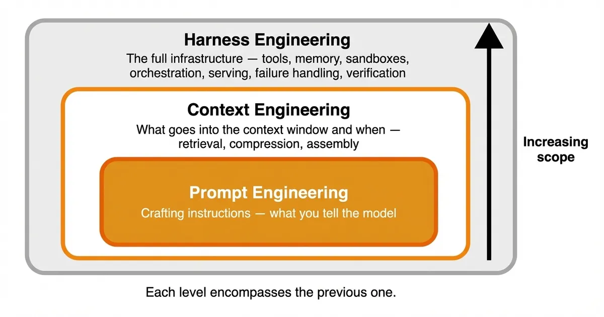

Harness Engineering은 Prompt Engineering, Context Engineering보다 더 큰 개념이다.

Prompt Engineering은 원하는 응답을 얻기 위해 모델에게 무엇을, 어떻게 지시할 것인지에 관한 것이다.

그러나! 단순 질의응답을 넘어, 더 복잡한 작업을 수행하게 되면서 단순히 최적화된 prompt만으로는 충분치 않게 되었다.
모델이 현재 작업을 수행하는 데 필요한 외부 도구, 파일, 가드레일 등을 얼마나 전달받고, 이해하느냐가 성능에 큰 영향을 끼치면서, Context Engineering이 중요해졌다.

또 그러나! 복잡한 장기 과제에서 작업이 한 번의 session이 아니라 여러 session을 거쳐 수행되면서 context만으로는 한계가 생긴 것이다.
새 session이 시작되면, 보통 이전 session의 상태나 작업 맥락이 완전하게 이어지지 않는 경우가 많다.
그래서 session이 계속 반복해서 다시 시작하게 되면, 이전에 무엇을 했는지, 어디까지 진행했는지, 어떤 문제가 발생했는지, 다음에는 무엇을 해야 하는지를 정확히 파악하기 어려워진다.

이 때문에 단일 session 안에서의 정보 맥락 구성만으로는 부족해 여러 session에 걸쳐 작업을 실행할 수 있도록 하는 시스템 전체가 중요해진다. 이를 다루는 게 Harness Engineering이다.

즉, Context Engineering은 주로 단일 session 안에서 모델에게 필요한 적절한 정보와 도구를 어떻게 제공할 것인지라면, Harness Engineering은 모든 session에서 일어나는 전체 환경을 어떻게 설계할 것인지를 다룬다.

Prompt < Context < Harness에 대해 다시 정리하자면,
Prompt Engineering은 모델에게 질문을 잘하는 기술,
Context Engineering은 Prompt에 맥락을 함께 주는 것으로, “여행지를 추천해줘” 라는 프롬프트에 사용자의 스케쥴, 평소의 취향, 현재 인기 있는 여행지 정보 등 맥락과 함께 하여 더 적합한 여행지를 추천할 수 있는 것이다.

그런데, 이렇게 맥락 정보와 도구 등이 많아지니까 우리가 타고 가야하는 말인 모델이 힘들어 한다. 그래서 Harness로 모델이 잘 달릴 수 있는 환경 자체를 설계하는 것이 Harness Engineering이다.

## 2/ Coding Agent가 갖고 있는 문제

### 문제 1️⃣ **Context Anxiety 🫨**

장시간 작업에서는 많은 양의 context window가 필요해질 수밖에 없다. 이때 context window가 꽉 차면서, 일관성을 잃고, 작업을 제대로 진행하지 못하는 Context Anxiety 현상을 보인다.
(우리도 너무 일이 많아지면, 어떤 일을 먼저 시작해야하는지, 무슨 일을 해야하는지 혼란스러운 것처럼 모델도 마찬가지다.)

### ✅ **Context Rest**

Context Anxiety 현상을 완화하기 위한 방법으로,
context window를 완전히 지운 뒤, 다시 새롭게 시작하는 것이다. 즉, 머리를 비우고 다시 시작하는 것이다.

context rest는 compaction과 다른 방식이다.
compaction은 대화의 앞부분를 짧게 요약해 같은 agent가 계속 작업을 연속적으로 진행할 수 있도록 한다.
하지만 요약한다고 해도 이전 대화의 흔적은 남아 있고, agent를 clean state로 새롭게 시작하는 게 아니므로, compaction 방식에서는 context anxiety가 여전히 존재할 수 있다.

반면, context rest는 다음 agent가 완전히 새롭게 시작하는 방식이며, 이전 대화의 흔적을 남기지 않는다.
대신, 작업을 이어 받을 수 있도록 handoff artifact에 지금까지의 핵심 상태만 정리해둔다. 그래서 이전 대화의 흔적은 없으면서 핵심 정보만 넘겨 받아 작업을 이어 수행할 수 있다.

### 문제 2️⃣  **Do too much at once**

처음부터 모든 지시사항을 넣으면 절대 안되는 이유가 바로 agent가 너무 많은 일을한 번에 다 하려고 하기 때문이다. (모델의 성능이 좋아지면 나아지겠지만, 아직은 문제가 남아 있는 것 같다.)

### ✅ Incremental Progress

그래서 Anthropic에서는 “점진적 공개” 방식 (Incremental Progress)으로 지시사항을 한 번에 다 주지 않고, 한 번에 하나의 기능만 점진적으로 구현하도록 했다.
각 단계가 끝날 때마다 git commit messages를 남기고, 이 과정을 요약한 progress file를 활용해 코드 관리가 용이해졌고, next agent가 작업을 어디서부터 시작해야할지 추측할 필요가 없어지게 되었다.

### 문제 3️⃣ **Self-Evaluation 👎**

에이전트가 자기가 한 작업은 관대하게 평가하는 self-evaluation 문제가 있다.
(사람도 자기가 한 일은 높이 평가하는 것과 정말 비슷한 것 같다..)

특히 디자인과 같이 정답이 명확하게 없는 주관적인 작업 같은 경우에 평가가 더 관대한 편이었다고 한다.
예를 들어, UI 디자인이 평범해도 너무 좋다고 말하는 편인 것이다.

### ✅ Generator, Evaluator 분리

GAN과 같이, 만드는 에이전트와 평가하는 에이전트를 분리하는 것이다.

generator는 실제 작업을 수행하는 agent이고, evaluator는 generator의 작업을 평가하는 agent다. 자기가 한 결과가 아니기에 조금 더 객관적으로 평가하지 않을까? 라는 아이디어에서 비롯된 것이다.

그러나 evaluator도 결국 모델이기에, 완전히 객관적인 평가를 하지 못하는 점은 남아 있다.
그래도 역할을 분리해서 evaluator를 비판적, 회의적으로 튜닝한다면 이전보다 더 나은 평가가 이뤄진다고 보고 있다.

## 3/ Harness 구성 요소

**Claude Code**를 중심으로 간략하게 Harness의 주요 구성 요소를 살펴 보자.

### 1️⃣  [`CLAUDE.md`](http://CLAUDE.md)

[CLAUDE.md](http://CLAUDE.md)는 agent를 위한 프로젝트 지침 파일이다. 쉽게 말하자면 온보딩 문서로, 처음 프로젝트를 접하더라도, 프로젝트를 빠르게 이해하고 적응하는 데 도움을 주는 것이다.
프로젝트 전체에 있어 중요한 프로젝트 구조, 네이밍 컨벤션 등을 보편적으로 지켜야하는 것을 주로 포함시킨다.

규칙을 많아지면 모델이 혼란스러워하므로, 정말 중요한 규칙 3-5개 (반드시 지켜져야 하는 constitution), 해당 프로젝트는 어떤 언어를 사용하는지 등 workspace 규칙 위주로 적는 것이 좋다.

또한, 우선순위를 명확하게 해 중요한 규칙이 충돌한 경우 어떤 규칙을 먼저 따라야하는지 명시하는 것이 좋다.

절대로 구구절절 설명문이 아니라, 프로젝트를 잘 파악할 수 있는 🗺️ map이어야 한다.

### 2️⃣ Skills

Skills는 [SKILL.md](http://SKILL.md) 파일로 정의되는데, 반복적으로 사용되는 작업을 쉽게 재사용할 수 있도록 하는 것이다.

Anthropic에서는 skills는 단순한 마크다운 파일이 아니라, scripts, assets, data 등을 포함할 수 있는 완전한 디렉토리 구조를 가지고 있다고 한다.

잘 만든 skill은 명확하며, 혼란스럽지 않다고 한다. 즉 하나의 skill에는 하나의 역할이 담겨 있어야 한다.

👀 Skills를 잘 작성하는 법은 [**Lessons from Building Claude Code: How We Use Skills](https://x.com/trq212/status/2033949937936085378?s=20)** 글을 보길 바란다.

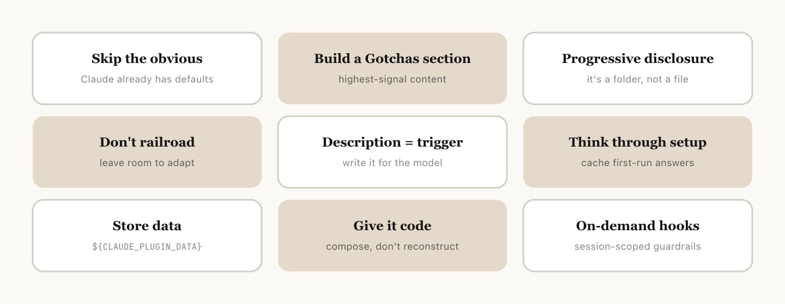

간단히 요약하면,

1. 모델이 이미 알고 있을 것 같은, 당연하고 뻔한 말은 쓰지 말기.

2. `## Gotchas` 섹션을 잘 활용하기. (모델이 반복적으로 실패하는 엣지 케이스를 파악하고, 기록하기)

    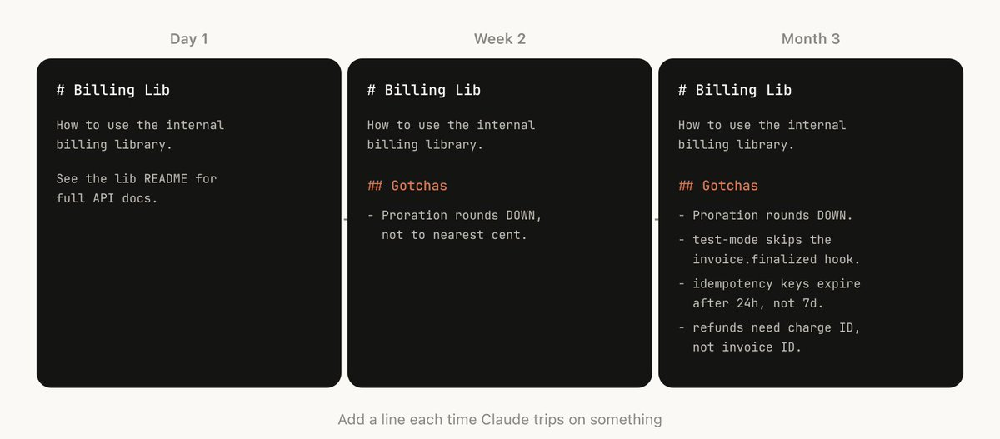

3. skill은 단순히 마크다운 “파일”이 아니라 “폴더” 구조라고 말한 것과 같이, 이 폴더 구조를 잘 활용하기.
(단순히 skill를 마크다운 하나에 통째로 넣는 게 아니라, 여러 파일로 분리해서 사용하는 등)

    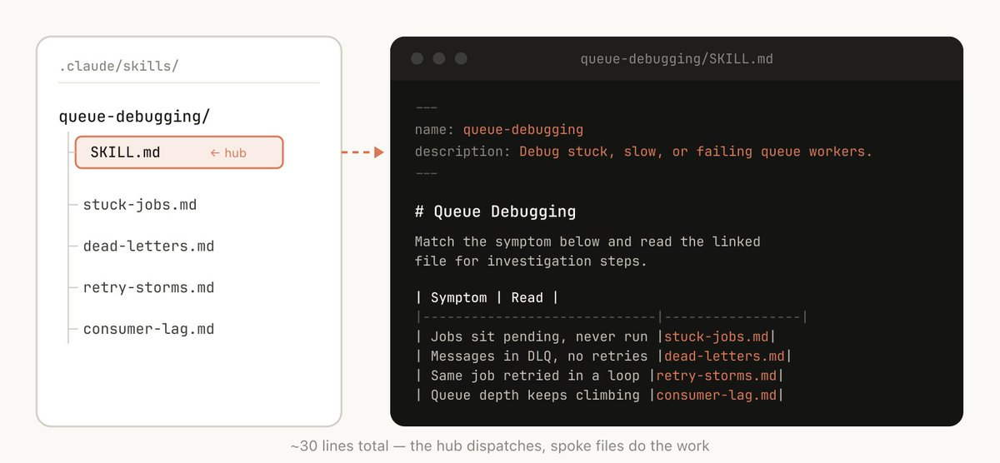

4. skill을 너무 구체적으로 쓰지 말기.
너무 구체적이면, 상황에 맞게 유연하게 행도하지 못하는 문제가 발생하게 됨.

    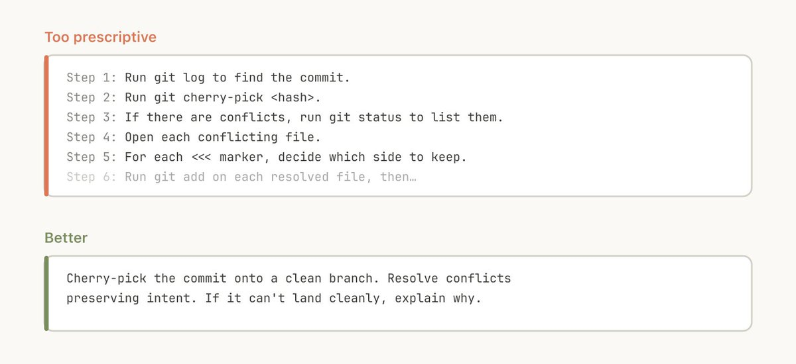

5. setup 세팅하기.
skills 폴더에 config.json 파일을 활용해 setup 정보를 저장하기. 예를 들어, Slack에 포스팅하는 skill 같은 경우, 어떤 slack channel에 포스팅할지 setup 정보를 정리하는 것.
+ 여러 선택지를 제시하길 원한다면 Claude Code의 **AskUserQuestion Tool** 적절히 활용하기.

    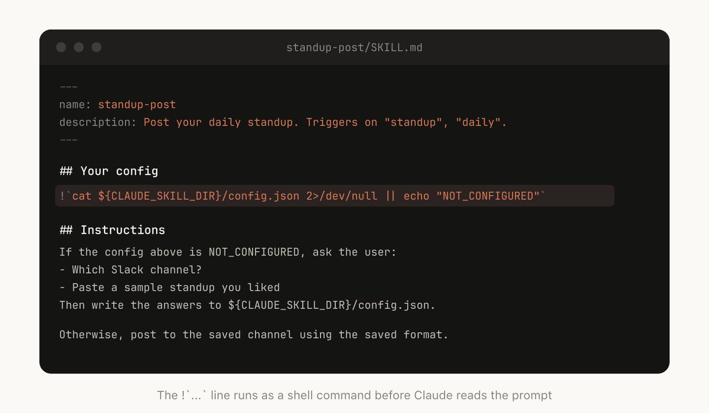

6. description 필드는 모델을 위한 것.

    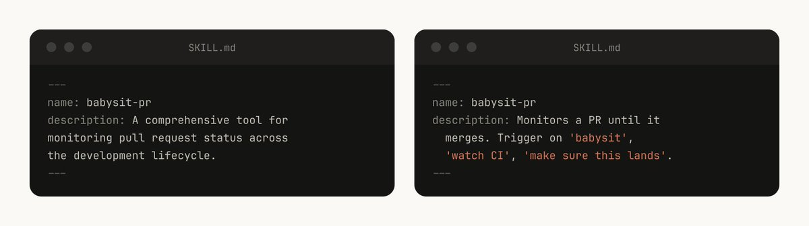

    description은 단순히 “요약”이 아니라 “모델이 언제 이 skill을 사용해야하는지”를 판단하기 위한 모델을 위한 필드이다.

7. 어떤 skill은 데이터를 memory로 활용하는 경우가 있는데, 이때 활용되는 데이터를 skill 폴더에 저장하지 말고, `${CLAUDE_PLUGIN_DATA}`와 같은 정적인 폴더에 저장할 것.
(skill 업그레이드하면 skill 폴더 안에 있는 데이터가 삭제될 가능성이 있음.)

    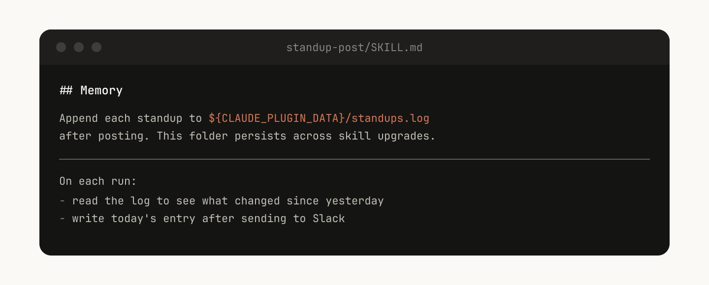

8. script 저장하고, 코드 생성하기.
사용해야하는 script와 library를 제공해두면, 코드 작성하는 데에만 자원 집중하게 됨.  모델에게 더 어려운 작업을 맡기도록 하자.

    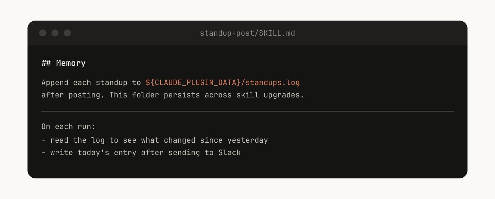

### 3️⃣ MCP (Model Context Protocol)

MCP는 Agent와 외부 간 연결을 통합해 더 쉽게 외부 도구에 접근하고 활용할 수 있도록 하는 프로토콜이다.

항상 정말 필요한 MCP부터 연결하는 것이 중요하다. 쓸데없이 많은 MCP를 연결한다면, token 사용량이 많아진다. 이를 방지하기 위해 주기적으로 사용하지 않은 MCP가 있는지 확인할 필요가 있다.

### 4️⃣ Hook

**Hook**은 event 기반으로 특정 시점에 코드를 실행해주는 자동화 트리거다.

- **Event**: Hook이 언제 실행될지 이벤트.
    - Session 단위: `SessionStart`, `SessionEnd`
    - Turn 단위: `UserPromptSubmit`, `Stop`, `StopFailure`
    - Tool 호출마다: `PreToolUse` (툴 실행 전), `PostToolUse` (툴 실행 후)
- **Matcher**: 어떤 경우에만 실행할지 필터링
- **Action**:  실제 실행할 command 또는 script 등.

*Turn은 요청을 보내고 응답을 받는 하나의 단위이고, Session은 전체 작업 단위 (Claude Code 프로세스 시작과 끝)

**👀 Hook 활용 예시**

- Claude가 파일 수정할 때마다 자동 포매팅 ➡️  `PostToolUse` prettier 실행
- `rm -rf` 같은 위험 명령 차단 ➡️  `PreToolUse` exit 2로 블로킹
- `.env` 파일 수정 시 비밀키 노출 감지 ➡️  `PreToolUse` 패턴 매칭 검사
- 세션 시작 시 환경변수 자동 주입 ➡️ `SessionStart` 컨텍스트 세팅

꼭 실행되어야 하는 규칙이라면, [`CLAUDE.md`](http://CLAUDE.md) 같은 prompt 기반 설정 대신 Hook을 사용하길 권한다. Prompt가 “모델에게 부탁”하는 것이라면, Hook는 “반드시 규칙이 실행되도록”하기 때문이다.

## 4/ Harness 설계 어떻게 해야할까?

간단명료하게 말하자면, Harness는 모델이 혼자서 못하는 것을 할 수 있도록 하는 것이다.

그러므로 Harness를 설계할 때, 모델이 무엇을 못하는지, 어느 부분에서 실수하는지 관찰하고, 이를 할 수 있도록 도와줘야 한다.

또한, 모델이 발전한다면 Harness 또한 재검토하고, 그에 맞춰 개선해야 한다. 모델이 혼자서도 더 잘할 수 있는게 많아진다면, 굳이 Harness가 도와줄 필요 없는 것이다.

## Reference

- [Effective Harnesses for Long-Running Agents](https://www.anthropic.com/engineering/effective-harnesses-for-long-running-agents)
- [Harness Design for Long-Running Apps](https://www.anthropic.com/engineering/harness-design-long-running-apps)
- [Autonomous Coding](https://github.com/anthropics/claude-quickstarts/tree/main/autonomous-coding)
- [Improving Deep Agents with Harness Engineering](https://blog.langchain.com/improving-deep-agents-with-harness-engineering/)
- [Agentic Harness Engineering](https://www.decodingai.com/p/agentic-harness-engineering)
- [하네스 엔지니어링이 뭔데? Anthropic이 직접 공개한 AI 성능의 진짜 비밀](https://www.linkedin.com/pulse/%ED%95%98%EB%84%A4%EC%8A%A4-%EC%97%94%EC%A7%80%EB%8B%88%EC%96%B4%EB%A7%81%EC%9D%B4-%EB%AD%94%EB%8D%B0-anthropic%EC%9D%B4-%EC%A7%81%EC%A0%91-%EA%B3%B5%EA%B0%9C%ED%95%9C-ai-%EC%84%B1%EB%8A%A5%EC%9D%98-%EC%A7%84%EC%A7%9C-%EB%B9%84%EB%B0%80-seungpil-lee-xnnmc)
- [Harness engineering](https://openai.com/ko-KR/index/harness-engineering/)
- [Threads post by @choi.openai](https://www.threads.com/@choi.openai/post/DVlRuy2jRpJ?xmt=AQF0IhwyqB0jY40lk0uM-Wd5KJNjvl8rZuJpbliMW1XtAg)
- [Lessons from Building Claude Code: How We Use Skills](https://x.com/trq212/status/2033949937936085378)
