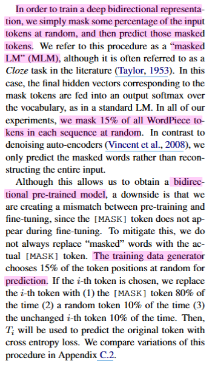

## How do the "masking" of LLaDA (Large Language Diffusion with Masking) and BERT differ?

[BERT (Bidirectional Encoder Representations from Transformers)](https://arxiv.org/abs/1810.04805) 와 [LLaDA (Large Language Diffusion with Masking)](https://arxiv.org/abs/2502.09992) 는 모두 “masking” 기법을 사용한다.

겉보기에는 비슷해 보이지만, 두 모델이 masking을 사용하는 방식은 다르므로, 어떻게 다른지 살펴보자.

### 1/ BERT vs. LLaDA

먼저, BERT**는** masking ratio이 고정되어 있고, LLaDA는 masking ratio [0, 1] 사이의 random masking ratio를 사용한다. → masking 비율부터 고정인지, 랜덤인지 차이가 있다.

LLaDA는 기존 BERT처럼 단순 MLM (Mask Language Model) 기반이 아니라 Diffusion 기반 모델이다.

BERT는 기본적으로는 비생성 모델이므로, 자연스러운 문장을 생성할 수 없다. (*요즘은 BERT도 텍스트 생성에 활용 가능하다는 주장이 많다. *Gibbs Sampling)

반면, LLaDA는 확률 생성 모델로, foward/reverse process를 통해 diffusion 방식으로 텍스트를 생성할 수 있다. (즉, in-context learning, instruction following 등 가능)

→ LLaDA가 BERT의 연장선인 것처럼 보이지만 (’masked token”을 예측한다는 공통점이 있어 비슷해 보임), 구조적으로 완전히 다르다.

|  | **BERT (MLM)** | **LLADA (Diffusion Model)** |
| --- | --- | --- |
| 목적 | 문맥 이해 (Representation learning) | 문장 생성 (Generative modeling) |
| 마스킹 비율 | 고정 (예: 15%) | 연속적 랜덤 t~U(0,1) |
| 모델링 목표 | 토큰 복원 | 데이터 분포 근사 p(x₀) |
| 학습 방식 | 단일 스텝, 독립 샘플 | Forward/Reverse multi-step process |
| 확률 모델링 | 없음 (likelihood 정의 안 됨) | 있음 (NLL 기반 학습) |
| 생성 능력 | 없음 X | 있음 (샘플링 가능) |
| Fisher consistency | 없음 | 있음 |
| 비슷한 모델 | RoBERTa, ELECTRA | LDM, MaskGIT, LLADA |

### 2/  Cross-Entropy Loss in BERT and LLaDA

$$
L(θ)=E_{t,x_0,x_t}[∑^L_{i=1}1[x_t^i=\text{masked token}]log\  p_θ (x_0^i∣x_t)]
$$

- $t$ ~ $U(0, 1)$ : masking ratio 0 - 1 사이에 연속적으로 샘플링한다.
- $x_t$ : $t$ 비율로 마스된 시퀀스
- $x_0$ :  정답 시퀀스

BERT와 LLaDA 모두 마스크된 토큰을 예측하기 위해 **Cross-Entropy Loss**를 사용하지만, LLaDA는 이를 Diffusion 모델 내에서 **NLL(Negative Log-Likelihood)의 Upper Bound**를 최소화하도록 구성한다. (BERT는 단순 Cross-Entropy Loss)

BERT는 Mask Predictor를  사용하여 model $p_θ​(x0_i​∣x_t​)$ 은 masked $x_t$를 입력 받아 masked token를 예측한다.

### 3/ 단순히 masking 비율이 고정 비율이냐, 랜덤 비율이냐 차이가 아니다

BERT (고정된 비율;15%의 토큰을 무작위로 골라서 마스킹) [https://arxiv.org/abs/1810.04805](https://arxiv.org/abs/1810.04805)

BERT는 MLM (Mask Language Model)로 전체 문장에서 일부 token을 마스킹하고, 이를 주변 문맥을 활용해 예측한다. 예를 들어 BERT는 15%를 masking했을 때의 문맥을 이해하는 것이 목적으로, 0%나 100% masking 상황에서는 제대로 작동하기 힘들다.

더불어, ARM (Auto Regressive Model)도 아니므로, 텍스트 생성 목적에는 다소 부적합할 수 있다. (주로 문장 분류, NER 등에 활용)

→ 특정 부분을 masking하고 복원해 “특정 위치 예측” 문제

→ “문장 이해” 목적 (분포 모델링, 생성이 주 목적이 아님.)

반면, LLaDA는 DLM (Diffusion Language Model)로, 0부터 1(전부 masking)이 되는 전체 분포를 모델링여, 아무것도 없는 상태에서도 정보를 생성할 수 있는 복원력을 갖춘다.

→ “데이터 생성” 목적

정리하자면,  MLM은 가려진 단어 하나 맞추는 식이라면, DLM은 문장을 점점 더 많이 가리고, 다시 맞춰가는 식이다.
