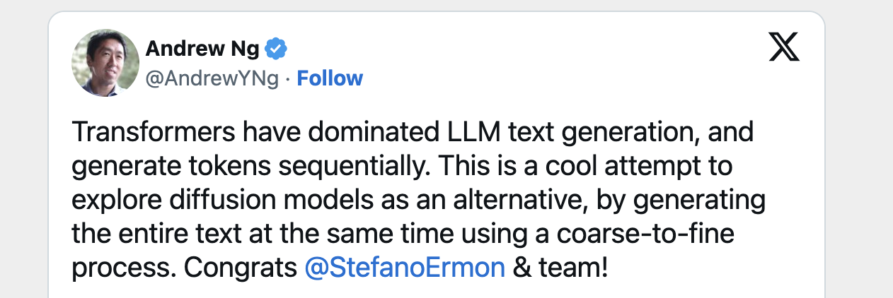
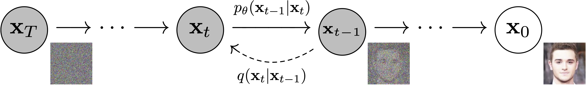
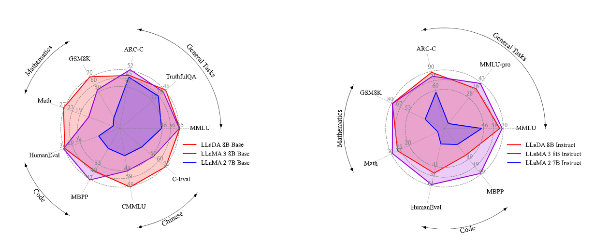
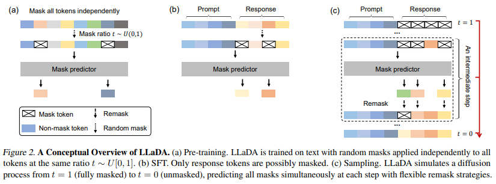
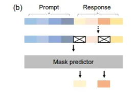

최근 등장한 Diffusion Models들은 ARMs (Autoregressive Models) 만큼 성능이 괜찮은 편이고, context-awareness 영역에서는 성능이 더  강하다는 평이 나오고 있다.
→ DLMs이 전통 ARMs 대체할 새로운 대안으로 부상하고 있는 것 같다.



## 1/ Background : Diffusion Models



Diffusion Model은 generative models의 한 종류로,
random noise를 점진적으로 추가 (forward), 점진적으로 denoise (reverse)하면서 데이터를 생성한다.

다양한 noise를 추가하고, 이를 복원하는 법을 모델이 학습하도록 훈련시키는 방법이다. 생성 시에는 random input을 반복적으로 업데이트해 결과를 점차 정제하며, 효율적인 sampling을 통해 적은 step으로도 고품질 데이터를 생성할 수 있다. 이후 conditioning, guidance 기법을 통해 출력 조절이 가능하다.

이미지 생성 분야에서 성공적이었는데, 최근 텍스트 생성에도 적용되는 움직임을 보이고 있다.

ARMs은 순차적으로 생성하는 반면, diffusion 모델은 텍스트 전체를 동시에 생성하고, 반복적인 수정 과정을 거쳐 최종 출력을 완성한다. →  생성 속도, 효율성 향상 e.g. Inception Labs의 Mercury

```python
# Set the noise scheduler
noise_scheduler = DDPMScheduler(
    num_train_timesteps=1000, beta_schedule="squaredcos_cap_v2"
)

# Training loop
optimizer = torch.optim.AdamW(model.parameters(), lr=4e-4)

losses = []

for epoch in range(30):
    for step, batch in enumerate(train_dataloader):
        clean_images = batch["images"].to(device)
        *# Sample noise to add to the images*
        noise = torch.randn(clean_images.shape).to(clean_images.device)
        bs = clean_images.shape[0]

        *# Sample a random timestep for each image*
        timesteps = torch.randint(
            0, noise_scheduler.num_train_timesteps, (bs,), device=clean_images.device
        ).long()

        *# Add noise to the clean images according to the noise magnitude at each timestep*
        noisy_images = noise_scheduler.add_noise(clean_images, noise, timesteps)

        *# Get the model prediction*
        noise_pred = model(noisy_images, timesteps, return_dict=False)[0]

        *# Calculate the loss*
        loss = F.mse_loss(noise_pred, noise)
        loss.backward(loss)
        losses.append(loss.item())

        *# Update the model parameters with the optimizer*
        optimizer.step()
        optimizer.zero_grad()

    if (epoch + 1) % 5 == 0:
        loss_last_epoch = sum(losses[-len(train_dataloader) :]) / len(train_dataloader)
        print(f"Epoch:{epoch+1}, loss: {loss_last_epoch}")
```

## 2/ TL;DR

LLaDA는 pre-training과 supervised fine-tuning (SFT) 방식으로 scratch부터 학습된 diffusion-based LLM으로, masking (forward process)와 denoising (reverse process - predicting masked tokens) 과정을 통해 확률적 생성 능력을 갖췄다. ARMs (e.g.  LLaMA3-8B) 대비 높은 scalability,와 in-context learning 성능을 보여주며, instruction-following 능력도 우수하다. 특히 reversal curse 문제를 극복하며 ‘Reversal Poem Completion’ task에서 GPT-4o보다 뛰어난 성능을 보여준다. → ARMs의 대안 가능성이 높은 것 같다.

### Case

`Prompt: *Explain what artificial intelligence is.*`


https://ml-gsai.github.io/LLaDA-demo/


## 3/ LLaDA (Large Language Diffusion with mAsking)




### Idea

Diffusion은 일반적으로 이미지 생성에 사용되는 방식이다. → 텍스트의 경우, 이미지처럼 continuous space가 아니므로, discrete latent space에서 diffusion을 수행하는 방식으로 응용한다.

- 이미지 : 연속적인 픽셀값 (연속 확률 분포) 보통 UNET 기반
Gaussian Noise 점진적으로 추가 → 노이즈 제거하면서 이미지 복원
- 텍스트 : 이산적인 토큰 (이산 확률 분포) **“discrete diffusion”** Transfomer 기반
LLaDA :  0 ~ 1 사이의 임의의 masking 비율을 사용해 토큰을 점진적으로 masking → masking된 token 예측하면서 복원한다.

    $$
    P(x_{ti} | x_{i}) = \begin{cases}1 - t & \text{if} \; x_{ti} = x_{i} \\ t & \text{if} \; x_{ti} = [MASK]\end{cases}
    $$


### Methods



**LLaDA**는 **masked diffusion model**로, pre-training, SFT(Supervised Fine-Tuning), sampling 세 과정으로 동작 과정을 나눠 볼 수 있다.

- **Pre-training**
    - input sequence의 모든 token을 무작위로 독립적으로 masking.
    - masking ratio $t$는 [0,1]에서 랜덤으로 샘플링 (각 token은 $t$의 확률로 masking됨)

        $t=1$에서 모든 token이 masking되고, 이 시점에 생성된 sequence를 $x_1$

    - 모델은 mask predictor로 각 position의 masked token을 복원하는 방식으로 학습.
    - diffusion의 forward process와 유사하게 데이터를 점차 noise (mask)로 만드는 과정.
- **SFT (Supervised Fine-Tuning)**



    - Prompt는 고정, Response 부분만 마스크
    - 모델은 masking된 response 부분을 예측하도록 fine-tuning.
    - Mask prediction loss로 학습.
- **Sampling**
    - $t=1$ (모든 token이 mask된 상태)에서 시작하여 $t=0$까지 진행.
    - mask predictor를 통해 mask 복원 (masking된 모든 token을 동시에 예측)
    maksing된 token이 무엇인지 예측.
    - 예측 후 일부 token은 unmask되고 일부는 다시 remask (flexible remasking)
    - 이를 반복해 점진적으로 $t=0$ (모든 token이 unmask된 상태) 완전히 복원.

- **Forward** process : 점진적 masking, **Reverse** process :  iterative unmasking
- Sampling에서 remasking & refine 과정을 거치며 높은 품질과 long-context 인지 능력을 확보.
- ARMs의 next-token-generation 방식보다 global context 이해도가 더 높음.

### Architecture

```python
마스크된 초기 상태 (x₁; t=1)
     │
     ▼
Mask Predictor (Transformer)
     │
예측된 토큰 (일부는 다시 마스크됨)
     │
     ▼
Remasking (Remasking 전략에 따라)
     │
     ▼
반복적 정제 (t: 1 -&gt; 0)
     │
     ▼
최종 텍스트 (x₀; t=0)
```

- Transformer 기반 mask predictor &  multi-head attention block 포함.

### Training

Training Objective

$$
L(\theta) \triangleq -E_{t, x_0, x_t} \left[ \frac{1}{tL} \sum_{i=1}^L \mathbb{1}[x_{it} = M] \log p_\theta (x_{i0}|x_t) \right]
$$

- random  timestep $t$  선택.
- 원시 텍스트에 noise (mask) 추가.

    $q(x_t|x_0)$

- 모델이 masking된 token 예측.

    $x_t$를 입력 받아 masking된 위치의 원래 token을 예측.

- **Loss :  Cross-Entropy Loss**

    예측된 token과 실제 token 간의 Cross-Entropy Loss를 계산하게 해 모델 업데이트.


### Sampling (Inference)

1. 초기 상태 설정

     모든 token이 masking된 초기 sequence $x_1$ 설정.

2. denoising 반복 $(t: 1 \rightarrow 0)$
    - $t$를 1에서 0으로 점차 줄여나가면서 단계 반복.

        mask predictor $p_{\theta}(x_0|x_t)$를 사용해 masking된 token 예측.
        예측된 확률 분포를 사용해 각 token이 해당 위치에 있을 확률 파악.
        가장 높은 확률을 가진 token을 선택하거나, 확률 분포에 따라 무작위로 token 선택 가능.

    - Remasking : 예측된 token 중 일부를 다시 masking.
3. 최종 텍스트 생성

    $t=0$이면 최종 텍스트 $x_0$ 생성.


### Accelerate:

- Pseudo-numerical solvers (DDIM)이나 fewer-step sampling 기법 사용.
diffusion을 근사하는 수치 해법을 사용해 더 적은 단계로 고품질 샘플 생성.
diffusion 과정의 각 단계를 최적화하거나  불필요한 단계를 제거해 추론 속도 향상.
- 최근에는 5~10 step만으로도 충분히 높은 품질 생성이 가능한 Fast DLM 연구도 진행 중.

### Scalability


## Reference

- [Large Language Diffusion Models (arXiv 2502.09992)](https://arxiv.org/abs/2502.09992)
- [Large Language Diffusion Models - Hugging Face Papers](https://huggingface.co/papers/2502.09992)
- [Is the Mercury LLM the first of a new generation of LLMs?](https://machine-learning-made-simple.medium.com/is-the-mercury-llm-the-first-of-a-new-generation-of-llms-b64de1d36029)
- [Paper Review: Large Language Diffusion Models - Andrey Lukyanenko](https://andlukyane.com/blog/paper-review-llada)
- [ML-GSAI/LLaDA: Official PyTorch implementation for Large Language Diffusion Models](https://github.com/ML-GSAI/LLaDA)
- [Inception Labs News](https://www.inceptionlabs.ai/news)
