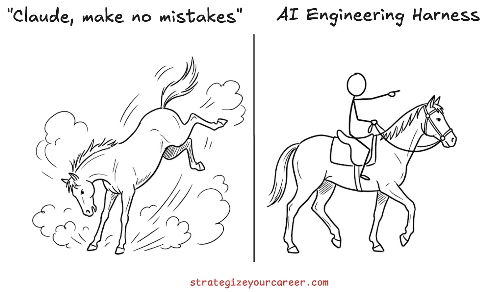
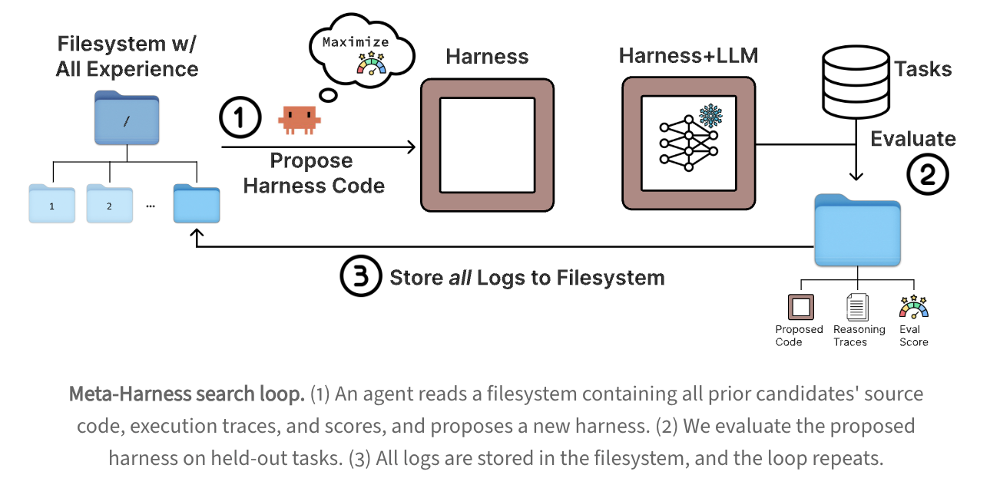
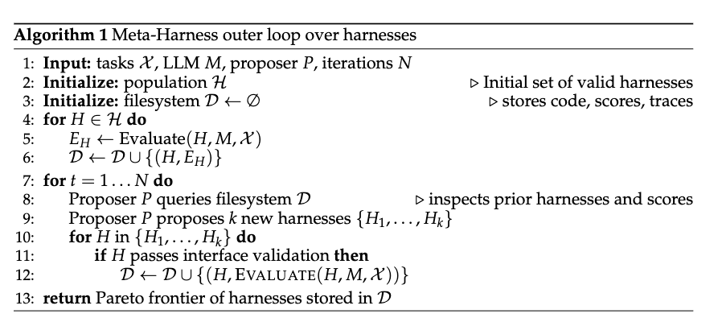
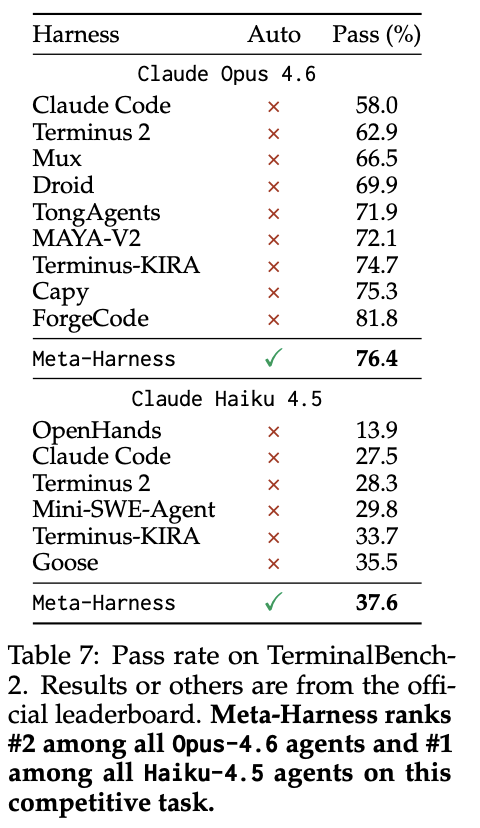
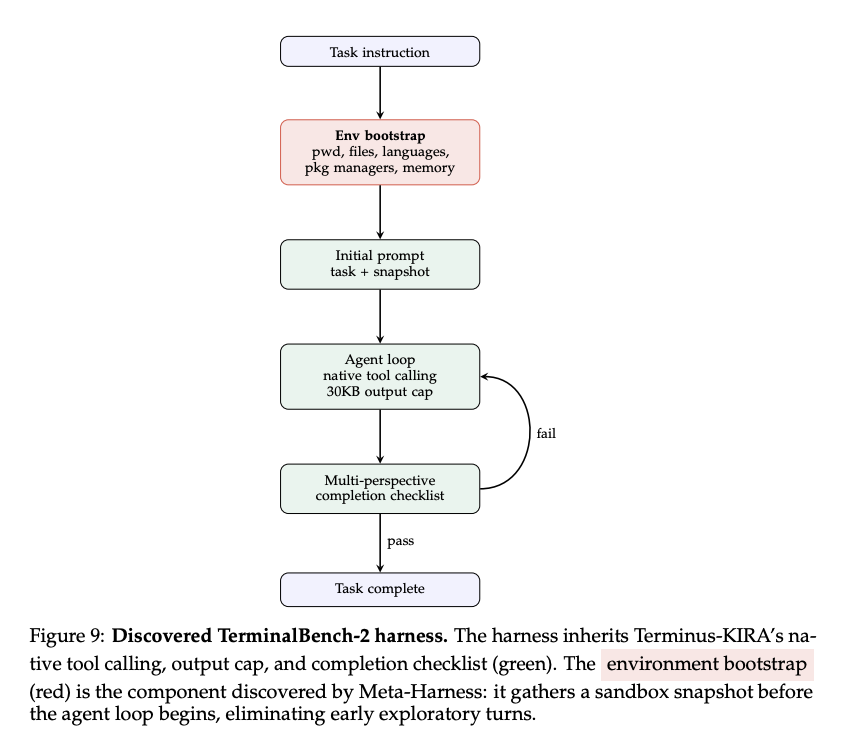

본 글은 **[Meta-Harness: End-to-End Optimization of Model Harnesses](https://yoonholee.com/meta-harness/)** 논문 리뷰 글이다.

## 0/ Harness

[https://strategizeyourcareer.com/p/harness-engineering-ai-agents](https://strategizeyourcareer.com/p/harness-engineering-ai-agents)

👀 이전 블로그 글에 [**Harness 개념**](https://blog.watchstep.me/posts/harness_engineering/)을 정리했으니 참고하길 바란다!

Harness를 간단히 말하자면, 모델이 아닌 모든 것으로, 모델이 잘 작동할 수 있도록 돕는 환경 자체를 의미한다. 모델이 🐴 말이면, Harness는 안장으로, 말이 잘 달릴 수 있도록 이끌어주는 것이다.

동일한 모델임에도 Harness를 어떻게 설계했느냐에 따라 성능 차이가 엄청나다. 그 때문에 모델의 바깥 환경을 개선하는 Harness Engineering은 2026년 현재 매우 중요하다.

## 1/ Human-written vs. Automated (Model-Optimized)

“Harness를 만드는 걸 인간이 수작업하기보다 모델 스스로 만들 수 없는 걸까?” 라는 질문으로 시작해, 기존 human-written harness의 문제점을 지적하고, Meta-Harness 라는 agent 스스로 task-specific하게 harness engineering하는 새로운 outer-loop 시스템을 제안한다.
(여기서 outer-loop는 무엇이고, 반대로 inner-loop는 무엇일까?, inner는 현재의 harness가 task를 해결하는 과정, outer는 더 나은 harness를 찾기 위해 다음 harness로 전환하는 과정으로, Meta-Harness는 주어진 task에 최적화된 harness를 탐색하는 시스템이다.)

### **❌ Human-written Harness의 한계**

인간이 직접 harness를 일일이 수작업하고, 반복해서 실패 케이스를 바탕으로 개선하는 방식이다.
그러나 인간은 모델이 하는 실수들, 왜 그런 실수가 발생했는지 원인을 추적하기 어렵다.
Harness 설계는 단순히 prompt를 입력하는 것이 아니라, 현재 어떤 작업을 했는지, 다음 작업은 무엇을 해야하는지, 해당 작업에서는 어떤 도구가 필요한지 등 복잡한 일이기 때문이다.

더불어 인간이 시도할 수 있는 실험 경우의 수가 적을 수밖에 없다. 코드를 수정하고, 다시 실행하고, 실패 원인을 분석하는 데 시간이 많이 들기 때문이다.
그리고, 인간이 확인하는 실패 케이스는 편향적일 수 있다. 모든 로그와 실행 흔적을 살펴볼 수 없기에, 눈에 띄는 실패 케이스를 보고 수정할 가능성이 크다.

### **❌ 기존 Text Optimization의 한계**

text optimization는 [GEPA](https://arxiv.org/abs/2507.19457), [OpenEvolve](https://github.com/algorithmicsuperintelligence/openevolve), [TTT-Discover](https://arxiv.org/abs/2507.19457)와 같이, prompt나 텍스트 결과물을 이전 시도들로부터 피드백을 받아 반복적으로 수정하는 방법이다. 그러나 이 방식은 Harness Engineering 설계할 때 문제점이 있다.

먼저, 피드백이 너무 압축적이라 왜 이전 시도들에서 실패했는지 원인을 자세히 파악하기 어렵다.
Harness는 보통 mutiple session으로 이루어진다. 즉, 단순히 한 번으로 그치지 않고, 여러 번의 reasoning step를 거쳐 일어난다. 그러기에 점수나 요약으로 압축된 피드백은 여러 단계를 거치면서 생기는 인과관계 정보를 놓치기 쉽다.

또한, Harness는 단순히 텍스트를 최적화하는 방식으로는 부족할 수 있다. Harness는 모델이 아닌 모든 시스템이기에, 현재 작업 상태, 정보를 제공하는 방식과 시점 등 복잡하다. 쉽게 말해, text optimization가 Harness를 감당할 수 없다는 것이다.

---

👀 논문에서 Harness를 LLM을 둘러싼 **stateful** program이라고 한다. 여러 번의 session, reasoning step을 거치기에, 중간 상태를 저장하고, 그 다음 단계에 무엇을 해야할지를 관리하는 것이기 때문이다.

### **✅ Meta-Harness**

따라서 해당 논문에서 Human-written 방식과 Text Optimization 방식을 극복한 Meta-Harness를 제안하다.

Meta-Harness는 모델이 해당 task를 잘 수행할 수 있도록 더 나은 Harness를 탐색하는 시스템으로, agentic proposer가 file system에 완전히 접근가능하게 하여, 이전 harness들의 소스 코드, 점수, 실행 흔적 등 code space를 바탕으로 개선한 새 harness를 제안한다.

여기서 포인트는 **file system**이다. 기존 text optimizatin 같은 경우, 피드백을 점수나 요약으로 압축해 제공하는 편이었는데, Harness를 개선하기 위해서는 더 많은 피드백이 필요하기 때문에 모든 과거 기록을 찾아볼 수 있는 file system에 접근할 수 있도록 한 것이다.

- 기존 방식: “이번 점수 62점. retrieval이 부족함” 같은 짧은 피드백만 제공함.
- Meta-Harness: “시험지, 오답노트, 공부법, 실제 풀이 과정”을 다 볼 수 있음.

## 2/ Meta-Harness: A Harness for Optimizing Harness

Meta-Harness는 Harness를 계속 평가하면서, 더 나은 최적의 Harness를 탐색하는 outer-loop 시스템으로, inner-loop는 하나의 Harness가 task를 해결하는 루프라면, outer-loop는 inner-loop 바깥에서, 어떤 Harenss가 좋은지 반복적으로 개선하는 루프이다.

그러면 Harness를 최적화하려면 어떻게 해야할까? 논문에서는 agentic propser가 이전 harness 후보들이 시도한 코드와 실행 흔적 등 code space를 살펴볼 수 있도록 하여 어떤 harness가 제일 최적인지를 탐색한다고 한다.

Meta-Harness의 구조를 간략하게 정리하면,

1. 초기 Harness로 task를 풀어보기.
2. 점수, 실패 사례, 실행 기록, 코드 등을 모든 log를 file system에 저장함.
3. propser agetnt가 스스로 log를 살펴 보고, 새 harness를 제안함.
4. 다시 반복 평가

### Objective

objective는 단순하다. “language model이 target task distribution에서 가장 잘 수행할 수 있도록 하는 harness를 찾는 것”이다.

여기서 language model $M$과 task distribution $\chi$는 고정이며, harness $H$만 달라진다.

$$
H^* = \arg \max_H \mathbb{E}_{x \sim \mathcal{X}, \tau \sim p_M(H, x)} r(\tau, x)
$$

- $x \sim \chi$ : task distribution에 나오는 task
- $\tau \sim p_M(H, x)$ : Harness와 Model이 상호작용하면서 만든 전체 rollout trajectory
- $r(\tau, x)$: task-specific reward function
- $H*$ : 가장 많은 최종 reward를 보인 harness, 최적의 harness

목표가 accuracy, context cost 등 하나의 목표가 아니라 다양한 목표일 경우, Pareto dominance로 후보를 평가하고, frontier를 본다고 한다. 예를 들어, 성능과 비용 중 각각 장점을 가진 좋은 후보 집합이 있어, 그 집합에는 성능은 제일 좋지만, 비용이 비싼 harness, 성능은 조금 낮아도 더 효율적인 harness 등이 있을 수 있다.

### Meta-Harness search loop

agentic proposer, 즉 coding agent $P$가 과거 소스코드, 점수, 실행 로그 등 file system $D$를 보면서 ‘왜 실패했는지’를 스스로 판단해 새 harness $H$를 제안한다. 이때, coding agent인 proposer가 규칙 없이 알아서 판단하고, 알아서 찾아보고 새로운 harness를 제안하는 것이다.
여기서 포인트는 꼭 최고 성능인 후보를 선택하라는 parent-selection rule이 없고, propser가 알아서 후보들을 살펴보는 것이다. 신기한 것은 coding agent가 성능이 좋은 후보를 기반으로 하라고 한 적도 없는데, 이전의 harness들을 찾아볼 때, 자연스럽게 성능이 괜찮은 후보들 위주로 찾아보는 것이다. (논문에서는 이를 emergent strategy라고 표현한다.)

coding agent는 파일을 직접 열어보고, `grep`, `cat` 같은 도구로 필요한 파일을 검색하고, 코드를 직접 수정할 수 있다. file system $D$에는 소스 코드, 평가 점수, 프롬프트, 도구 호출 등 실행 흔적들이 저장되는데, 매 단계를 반복하면서 커지기 때문에 context winodw에 다 들어가지 않으므로, `grep`, `cat` 같은 도구로 필요한 것만 검색해서 본다.

### Practical Implementation

논문에서는 각 harness가 single-file Python program이며, task-specific prompting, retrieval, memory, orchestration logic 등을 수정한다고 한다. proposer로는 Claude Code with Opus-4.6, base model은 domain에 따라 다르지만 항상 frozen이었다고 한다. 그리고 약 20번 반복동안 약 60개의 harness를 평가한다고 한다.

## 3/ Results

Online Text Classification, Retrieval-augmented problem solving 등 여러 실험을 진행했는데, 이 중 Agentic Coding 실험 결과에 대해 살펴 보겠다.

Agentic Coding Benchmark인 TerminalBench-2에서, Meta-Harness가 기존의 harness보다 더 나은지를 평가하고자 했다.

실험에서 Claude Opus 4.6, Claude Haiku 4.5를 base model로 사용했고, 기존 Terminus 2, Terminus-KIRA를 베이스라인으로 삼아 시작했다.  그 결과, Opus 4.6에서는 Meta-Harness가 76.4% pass rate로, Terminus 2의 62.9%와 Terminus-KIRA의 74.7%보다 성능이 좋았고,
Haiku 4.5에서는 37.6%로, Terminus 2의 28.3%, Terminus-KIRA의 33.7%를 넘었다. 특히 Haiku 4.5 기준으로는 기존 최고 성능인 Goose의 35.5%도 능가했다.

Meta-Harnees가 TerminalBench-2에서 탐색한 최종 Harness 구조로, 초기 환경을 먼저 파악하고, 마지막에 checklist로 정말 다 완료했는지 검증하는 구조이다. 기존 Teminus-Kir는 초록색인데, Meta-Harness는 그 앞에 빨간색 environment bootstrap 구조를 추가해 기존에 좋은 구조는 그대로 두면서 개선했다.

## 4/ Practical Implementation Tips

### 1️⃣ Write a good skill

proposer가 잘 search할 수 있도록 skill을 잘 작성해라. 여기서 말하는 skill은 쉽게 proposer의 역할, 폴더 구조, 규칙, 목표를 정의하는 것이다.  full run 돌리기 전에 3-5번 few short evolution runs 돌려서 skill를 디버깅하고, 개선해야한다고 한다. iteration 수나 population size (후보 harness 집합 크기)보다 skill이 search 품질에 더 큰 영향을 미칠 정도로 skill이 무척 중요하다고 한다.

### 2️⃣ Start with a baseline harness and a search set that is hard for it

처음부터 좋은 baseline, 그리고 그 baseline harness가 실수하는 것들 위주로 search set을 만들어라. 예를 들어 few-shot prompting으로 baseline이 자주 실수하는 것만 골라 search set을 만들어 search optimization을 돕는 것이다. 너무 쉬운 것만 있으면, 굳이 개선하지 않을테니 자주 실수하고, 어려운 것으로 구성하라는 것이다.

또한 search set는 run 당 약 50번 정도 full evaluation이 가능할 정도로 작게 유지하라고 한다. set 크기보다 질이 중요하다고 강조한다. (고품질 작은 데이터셋)

### 3️⃣ Log everything in a format that is easy to navigate

log를 잘 정리해야 proposer가 이를 보고 search할 수 있기 때문이다. 단순히 기록용 log가 아니라 propser가 log를 보고 이해해야 하는 자료라는 것을 명심하자.

### 4️⃣ Make logs queryable through a small CLI (optional, but helpful)

file system만 있어도 되지만, 매번 `ls`, `grep`, `cat`으로 검색하면 힘드니까 보조 CLI가 있으면 편하다.

### 5️⃣ Lightweight validation before expensive benchmarks

full evaluation 하기 전에 기본적인 오류가 없는지 smoke test를 해라. 작은 validation set 만들어서 잘 실행되는지, harness가 잘 만들어지는지 먼저 확인하라는 것이다.

### 6️⃣ Automate evaluation outside the proposer

evaluation 같은 경우 간단하므로, proposer가 하게 만들지 말고, propser 바깥에서 따로 평가해서 filesystem에 기록하라는 것이다. proposer가 본래의 역할인 필요한 기록을 찾아 문제를 파악하고, 새 harness를 제안하는 일에만 집중할 수 있도록 하는 것이다.
